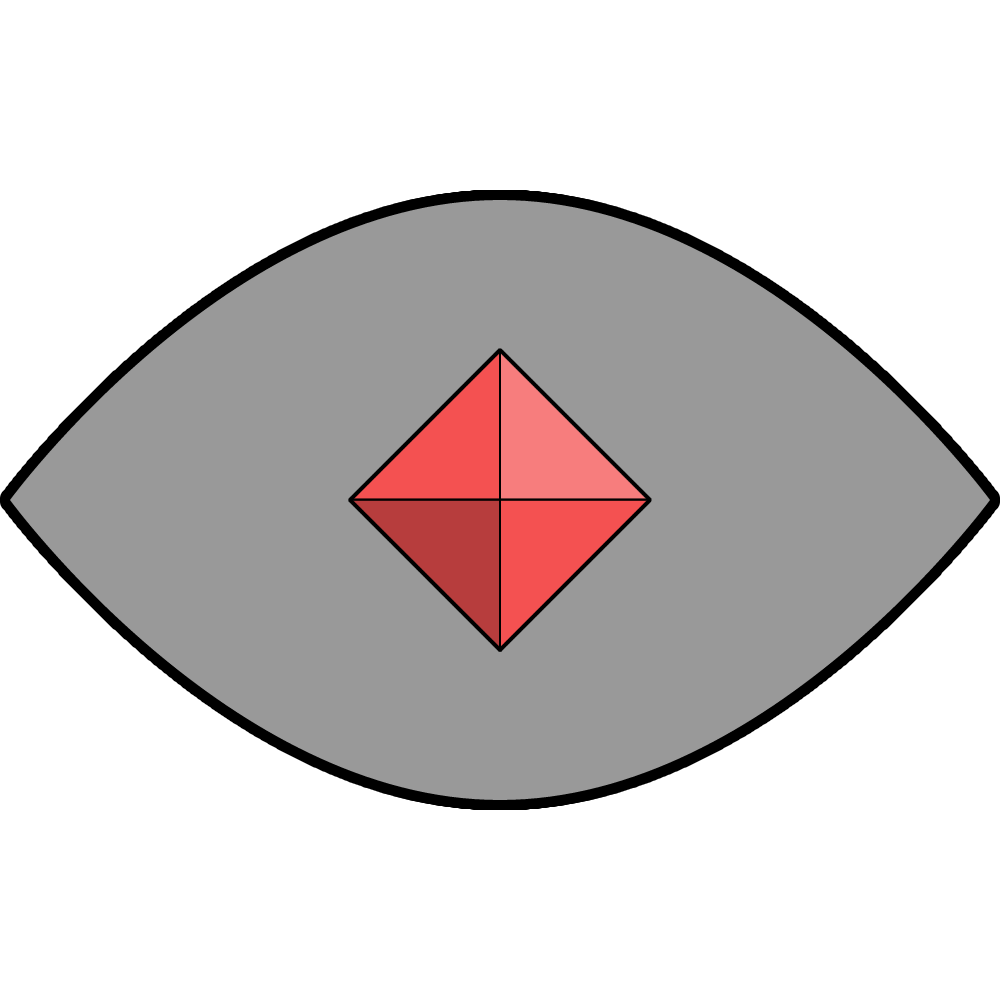

# Military Badges

Most military members are given a badge that identifies them as belonging to their organisation. This is used as a form of identification.

| [Astornar](organisations/astornar.md) | [Astornox](organisations/astornox/README.md) | [Astorrel](organisations/astorrel/README.md) | [Astornos](organisations/astornos.md) |
|:---:|:---:|:---:|:---:|
|  |  |  |  |

## Appearance

Each badge is made of a thin slate-like stone that is filed to be flat and smooth on both sides. It is cut to the shape of the organisation to which it belongs:

- [Astornar](organisations/astornar.md): circle.
- [Astornox](organisations/astornox/README.md): triangle.
- [Astorrel](organisations/astorrel/README.md): square.
- [Astornos](organisations/astornos.md): eye shaped.

Each badge is inlaid with a ruby that is cut into the shape of a square based pyramid, resembling the symbol of the [Kingdom of Astor](README.md).

## Enchantment

Each military badge is enchanted with a level 5 enchantment spell that encodes the ruby with information about the wearer. It includes the name of the wearer, their rank, superior officer, and where they are stationed.

A homebrew spell can be used to read military badges. It functions similar to [Detect Magic](https://www.dndbeyond.com/spells/detect-magic).

## Distribution

Military badges are given to military members when they attain their rank. They are reissued when they are promoted, with the new badge containing an enchantment for their new rank details.

Not all military members are given a military badge. Due to the size of the [Astornox](organisations/astornox/README.md), only officers are given badges. All [Astorrel](organisations/astorrel/README.md) of rank Squad Hand and above are issued one, and all [Astornar](organisations/astornar.md) members are too.

Not having a military badge or not having it to hand when it is needed can make it difficult to be accepted or access areas restricted to military members only.

### After Retirement

Once a military member retires, they are given a new military badge which is only enchanted with their name. This signifies that they are not actively serving.

Military only areas may accept retired citizens or not depending on their use.

## Usage

First and foremost, military badges give a visual impression of the organisation that the member belongs to. This can be useful when convincing someone of your trustworthiness or inclusion into the organisation, or exclusion from jurisdiction (e.g. [Astornox](organisations/astornox/README.md) cannot punish [Astorrel](organisations/astorrel/README.md)).

Certain areas in towns and cities exist that only permit access to military members, or members of a specific organisation. Access is only permitted by presenting a military badge at the point of entry.

In more sensitive areas, or when solid proof of identity is needed, the enchantment on the badge can be read to see more specifically who the bearer is and what their rank is. However, this can only be done by those who know the spell.

## Forgery

There are those who seek to deceive others by forging military badges. They may wish to convince someone of their authority, or access a restricted area.

Military members who frequently check military badges will know what to look for when checking badges, particularly the ruby at its centre.

The best way of spotting a forgery is checking the enchantment on the ruby. The ability to enchant a military badge is closely guarded, and so it is thought impossible to fake this aspect of the badge. The low likelihood of coming across someone who can check the enchantment means that applying an enchantment is not necessary.
