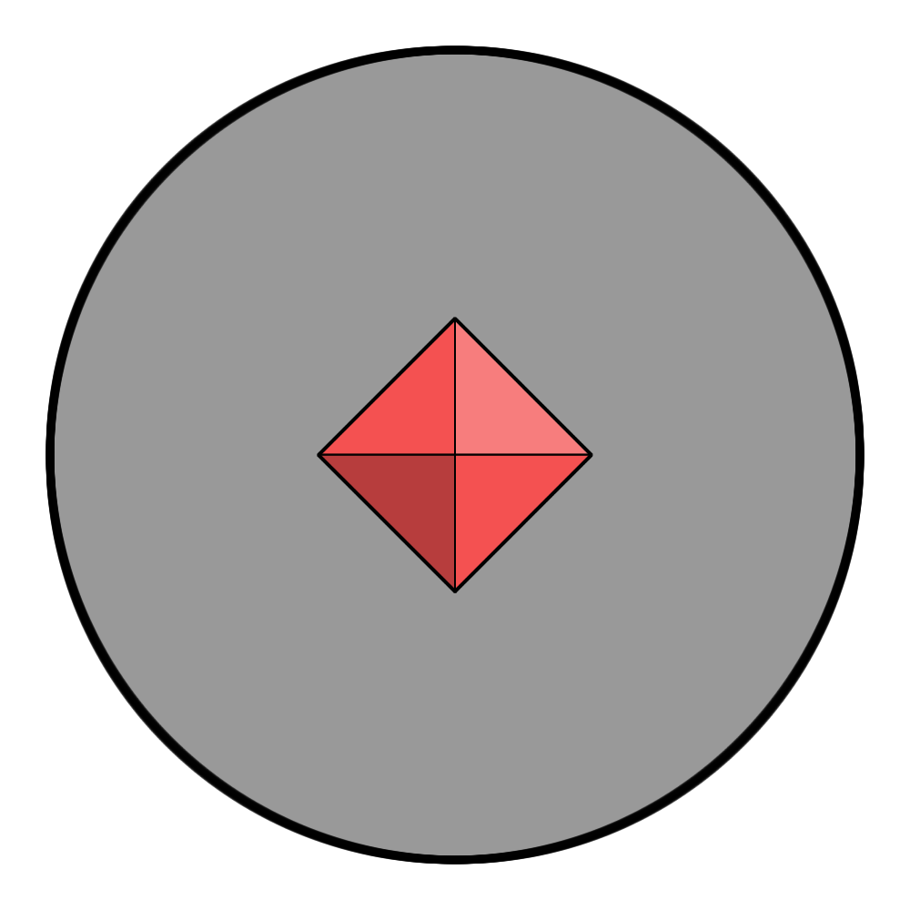

# Astornar

|  | |
| --- | --- |
| **Name** | [Astorrel](astorrel/astorrel.md) |
| **Civilisation** | [Kingdom of Astor](../README.md) |
| **Officially Sanctioned?** | Yes |
| **Leader** | Corville Thornox (General Supreme) |
| **Patron God** | [Bhygar](../../../gods/gods/bhygar.md) |

TODO:

At the highest echelons of power sits the Astornar. It is the ruling body surrounding the top generals. All other institutions are subservient to the Astornar. This means that any matters where more than one institution has opposing views is resolved by the Astornar. In this sense they act as a sort of “supreme court” or final verdict.

The symbol of the Astornar is that of the [Kingdom of Astor](../README.md), set inside a grey circle. It is worn as a pin on the left side of the chest. These pins are magical items, encoded with details of the wearer and their orders.
