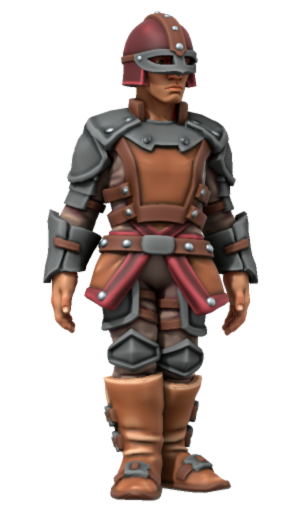
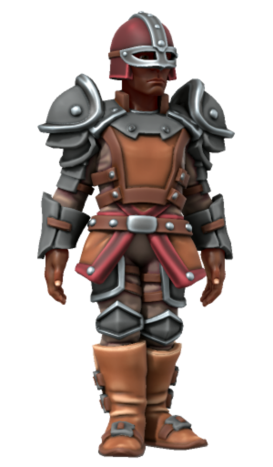
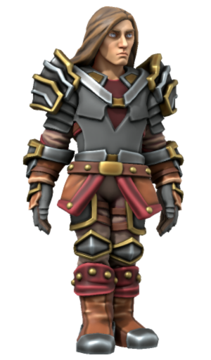

# Astornox

|  | |
| --- | --- |
| **Name** | Astornox |
| **Civilisation** | [Kingdom of Astor](../../README.md) |
| **Officially Sanctioned?** | Yes |
| **Leader** | |
| **Patron God** | [Gormox](../../../../gods/gods/gormox.md) |

## Summary

The Astornox is a military organisation of the [Kingdom of Astor](../../README.md). It is empowered to carry out its duties by the [Astornar](../astornar.md). It is the largest organisation in Astor, encompassing a variety of duties including: army and war efforts, guards and peacekeeping, protection from natural threats, local government, and punishment.

Its name is a combination of Astor and [Gormox](../../../../gods/gods/gormox.md), its patron god.

## Imagery

### Symbol

The Astornox symbol is a grey triangle with the diamond shaped ruby of Astor embedded in its center.

### Uniform

There are a variety of Astornox uniforms which vary depending on both rank and responsibility.

The most noticeable Astornox uniforms are that of the guards and their commanding officers. Leather armour is commonplace, with red dyed leather elements helping to create a distinct Astornox style.

The higher the [Astornox guard](ranks/1-guard.md) rank, including into officer ranks, the more ornate the armour appears, with more protection and embellishments, featuring gold trim for officers.

| Guard | Guard Sergeant | Captain |
|:---:|:---:|:---:|
|  |  |  |

## Ranks

As part of the Astor military, Astornox have a rank hierarchy that passes orders down from a single person to every Astornox beneath them.

- Officers:
  - [Astornox Commandant](ranks/7-commandant.md): Leader of the Astornox.
  - [Astornox Major](ranks/6-major.md): Leader of a city or large town.
  - [Astornox Captain](ranks/5-captain.md): Leader of a small town, or an area of concern of a larger settlement.
  - [Astornox Lieutenant](ranks/4-lieutenant.md): In charge of specific aspects of governance, likely including guard sergeants.
- Enlisted:
  - [Astornox Guard Sergeant](ranks/3-guard-sergeant.md): In charge of a group of guards.
  - [Astornox Guard Corporal](ranks/2-guard-corporal.md): Guard with extra tasks, responsibility, and autonomy.
  - [Astornox Guard](ranks/1-guard.md): Basic guard with simple responsibilities.

---

TODO:

The Astornox is the main institution in the kingdom. Everyone from the lowliest soldier to those just below the generals of the [Astornar](../astornar.md) are typically members of the Astornox.

There is a rigid command structure, explicit orders given, and an expectation of complete loyalty above all else.

The Astornox operate out of their own buildings, often in areas sectioned off from everyone else.

The symbol of the Astornox is that of the [Kingdom of Astor](../../README.md), set inside a grey triangle, face up. Medium to high ranking members wear a pin just like the [Astornar](../astornar.md) do, but it is not typically seen on lower ranking members due to cost.

## Imagery

### Symbol

The Astornox symbol is a grey triangle, pointed upward, with the diamond shaped ruby of Astor embedded in its center.

### Uniform

TODO:

Decked out in Captain’s regalia: leather armour with delicate embossing of horses and swords, silver insignia of a bear in the centre. Plate shoulders with golden flower details. Astornox pin on his left side. Rapier with an ornate handle in a scabbard.

## Ranks

TODO:

- General
- Colonel
- Captain
- Lieutenant
- Sergeant
- Private
