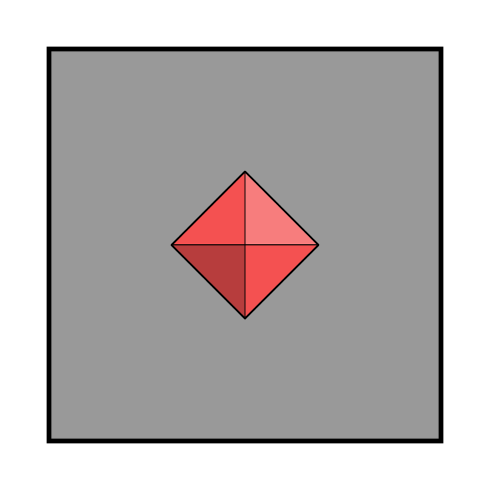
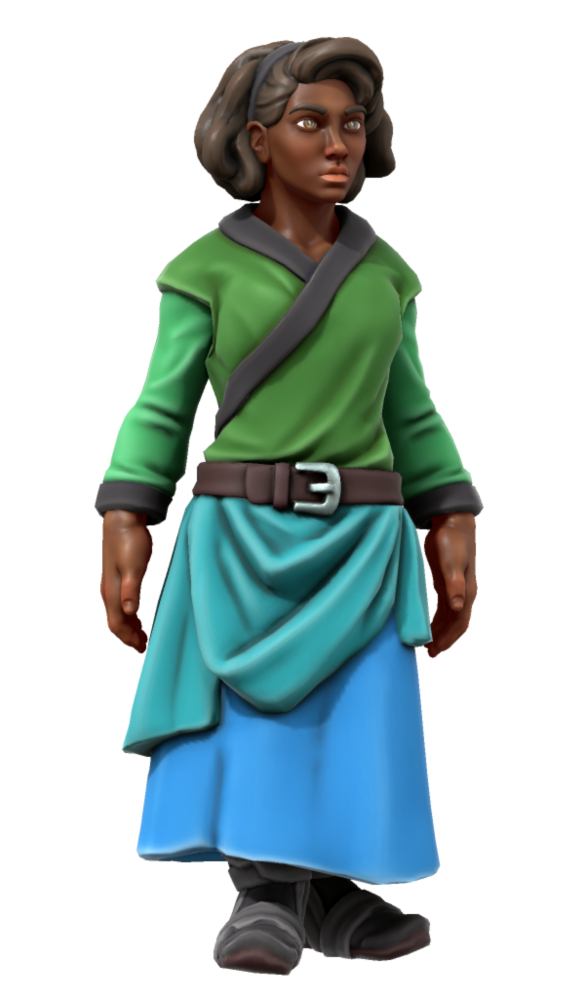
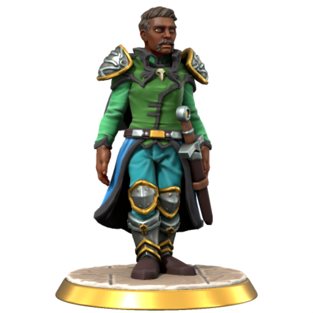

# Astorrel

|  | |
| --- | --- |
| **Presiding General** | |
| **Commandant** | [Levelle Tristwix](../../../../people/levelle-tristwix.md) |
| **Patron God** | [Kirrel](../../../../gods/gods/kirrel.md) |

## Summary

The Astorrel is a military organisation of the [Kingdom of Astor](../../README.md). It is empowered to carry out its duties by the [Astornar](../astornar.md). It is the second largest organisation in Astor behind the [Astornox](../astornox.md), though it is tiny by comparison.

Its name is a combination of Astor and [Kirrel](../../../../gods/gods/kirrel.md), its patron god.

## Imagery

### Symbol

The Astorrel symbol is a grey square with the diamond shaped ruby of Astor embedded in its center.

### Uniform

[Astorrel members](ranks/1-member.md) have no formal uniform outside of ceremonies - they are allowed to wear what they wish when on missions.

For ceremonies they wear robes in the colours of [Kirrel](../../../../gods/gods/kirrel.md) - from top to bottom: green, mint green, turquoise, blue. During ceremonies they are not permitted to wear anything else or wield any possessions or weapons.

Higher ranking Astorrel wear a more militaristic uniform during ceremonies and whilst within Astorrel strongholds inside of cities. This incorporates the same colours, but features pauldrons, leathers, and some plate elements.

| Ceremonial Robes | Officer's Uniform |
|:---:|:---:|
|  |  |

## Mission

The Astorrel are tasked with protecting the natural world from the [Kingdom of Astor](../../README.md) itself. Civilisation is constantly encroaching on nature, so they are tasked with managing the degree to which this happens in order to keep nature and civilisation in balance.

Without the Astorrel, Astor would simply consume all of the resources around them to the point of exhaustion, which could spell the collapse of Astor itself. This mission is considered incredibly important by the [Astornar](../astornar.md) and Astorrel, but others (particularly the [Astornox](../astornox.md)) don't see its significance.

Additionally the Astorrel investigate natural phenomena that cannot be explained, attempting to provide the kingdom with tangible knowledge. This could empower Astor with new technology or power, or make them aware of eminent threats. In this sense, the Astorrel are also guardians against the unknown, and explorers of the fringes of the kingdom.

## Reputation

Within the cities, Astorrel are highly regarded as peace keepers that preserve the natural order, free from the politics of the [Astornox](../astornox.md).

Outside of the cities, many people don't know of the Astorrel or fully understand their mission. This leads to apprehension or apathy, with some Astorians not taking their authority seriously.

### [Astornox](../astornox.md)

Typically speaking there is animosity between the [Astornox](../astornox.md) and Astorrel. This is because they often disagree on each others' rulings, with conflicts being hard to settle.

- The [Astornox](../astornox.md) regard the Astorrel as an unnecessary pain and meddling.
- The Astorrel regard the [Astornox](../astornox.md) as selfish and dangerous.

## Jurisdiction

Like the [Astornox](../astornox.md), the Astorrel can pass judgement on any people in the [Kingdom of Astor](../../README.md) that are not serving military and are not caretakers of [The Order of the Diamond](../../../../gods/the-order-of-the-diamond.md).

### Punishment

Officially punishment can only be carried out by Astorrel officers, but as the organisation has evolved, this power has been informally extended to Squad Leads so that officers don't have to get their hands dirty in the field anymore.

As is typical for the military, their is no written law, so punishment is whatever is deemed necessary. Applying a punishment that does not sufficiently deter is seen as a failure of the person applying the sentence.

## Squads

All Astorrel that complete field missions are placed into squads of four. This includes a Squad Lead and three Squad Hands, the former of which is responsible for the others. They are given missions by their superior, a Squad Sergeant, who may manage multiple squads.

Squads are sent out across the kingdom to check up on activities and investigate. They are paid per mission in gold upon their return, and are typically set time limits for how long they take.

While out on missions, they are completely autonomous and may not have any contact with other Astorrel due to how few members there are. As a result Astorrel are expected to be resourceful and resilient.

### Known Squads

- [Astral Squad](squads/astral.md)
- [Players Squad](squads/players.md)
- [Ruby Squad](squads/ruby.md)

## Ranks

As part of the Astor military, Astorrel have a rank hierarchy that passes orders down from a single person to every Astorrel beneath them.

- Officers:
  - [Astorrel Commandant](ranks/7-commandant.md): Leader of the Astorrel.
  - [Astorrel Captain](ranks/6-captain.md): Leader of the Astorrel stronghold in a specific city.
  - [Astorrel Lieutenant](ranks/5-lieutenant.md): Creates missions for multiple squad sergeants.
  - [Astorrel Squad Sergeant](ranks/4-squad-sergeant.md): Commands multiple squads to complete their missions.
- Enlisted:
  - [Astorrel Squad Lead](ranks/3-squad-lead.md): An elevated Squad Hand with authority over their squad of four.
  - [Astorrel Squad Hand](ranks/2-squad-hand.md): Members of a squad of four who complete field missions.
  - [Astorrel Member](ranks/1-member.md): The lowest rank. Saved for those who do not partake in field missions.

## Recruitment

The Astorrel is always looking for new potential recruits. Each year they aim to recruit 100 new members into their ranks.

### Finding Recruits

*See also: [Magicborn](../../magicborn.md)*

Astorrel officers look for potential recruits in all sorts of places. Anyone who shows potential may be asked if they wish to join their ranks. An accomplished brawler, seasoned adventurer, gifted [magicborn](../../magicborn.md), or repentant prisoner are all welcome.

Conscripted [magicborn](../../magicborn.md) can be poached by Astorrel officers through a contested process that is adjudicated by the [Astornar](../astornar.md).

All potential Astorrel recruits must be willing to join their ranks - there is no forced service for anyone, including conscripted [magicborn](../../magicborn.md) (though if they say no, they will join the [Astornox](../astornox.md) instead).

### Training Recruits

Recruits are trained by the Astorrel for between two and four years, depending on experience and need for new recruits. During this time their equipment, food, and accommodation is paid for by the organisation.

They learn combat training, wilderness survival, how to read and write, the history of the world, and all manner of things relating to nature and the delicate balance Astor keeps with it through the Astorrel.

Astorrel recruits train in Dunmore, and do not typically travel to [Northhaven](../../settlements/northhaven/README.md) prior to their graduation.

### Graduation

*See also: [Astorian Calendar](../../../../history/astorian-calendar.md)*

Each year the recruits that are ready to graduate travel to [Northhaven](../../settlements/northhaven/README.md) for the graduation ceremony. It takes place in the month of Finsbock or Taledus (one of the [Kirrel](../../../../gods/gods/kirrel.md) months).

Prior to the ceremony, the Astorrel officers decide which rank each recruit will start at, and which existing officers will become their superior officers.

The ceremony is witnessed by existing [Astorrel members](ranks/1-member.md), including all of the officers present in [Northhaven](../../settlements/northhaven/README.md) at the time. During the show of faith, [Astornox](../astornox.md) and some [Astornar](../astornar.md) witness them while they are in the Military District.

### Pledge

At the start of the ceremony, all recruits are assembled in [Kirrel](../../../../gods/gods/kirrel.md) Hall for the pledge. This is comprised of a speech from the Commandant followed by a pledge to the organisation, instilling a sense of duty and commitment.

### Show of Faith

Following the pledge, the recruits have an hour to pledge themselves to an insider god in order to show their faith to [The Order of the Diamond](../../../../gods/the-order-of-the-diamond.md). Practicing this religion is a requirement to become a member, though this is realistically the only time when that faith is tested.

Members make their way out of the Astorrel District, through the Military District, and out to the Officer District to Diamond Prime, the main temple of the religion in all of Astor. Their route to and from the temple is lined with military members, citizens and drigg alike who witness their pledge.

Once inside the temple, each member chooses their patron god. This decision is theirs alone and is not pre-registered prior to this ceremony. They approach the altar of their chosen god and pray to them however they wish.

They then have their foreheads marked with coloured paint in their god's colour, in a shape representing their symbol. This acts as proof of their deed, and is kept on their forehead for the rest of the graduation ceremony.

### Promotion

After the hour has elapsed, the final state of the ceremony begins. One by one each recruit is called to the front, witnessed by all of the other recruits present. They are told their starting rank, affixed their rank pin, and given an initial allowance of gold for which to buy their starting supplies and equipment.

Following this their superior officer finds them, introduces them to their team, and gives them orders. For Squad Hands this means meeting their Squad Sergeant, the rest of their squad, and being given their first mission.

## People

| Name | Rank | Significance |
| --- | --- | --- |
| [Levelle Tristwix](../../../../people/levelle-tristwix.md) | Commandant | |
| [Bryce Morton](../../../../people/bryce-morton.md) | Squad Sergeant | Sergeant to [Players Squad](squads/players.md) and [Ruby Squad](squads/ruby.md). |
| [Darius Dunn](../../../../people/darius-dunn.md) | Squad Hand | [Ruby Squad](squads/ruby.md) |
| [Morgan Caithness](../../../../people/morgan-caithness.md) | Squad Hand | [Ruby Squad](squads/ruby.md) |
| [Penance Zahiri](../../../../people/penance-zahiri.md) | Squad Hand | [Ruby Squad](squads/ruby.md) |
| [Tabari Se](../../../../people/tabari-se.md) | Squad Hand | [Ruby Squad](squads/ruby.md) |
