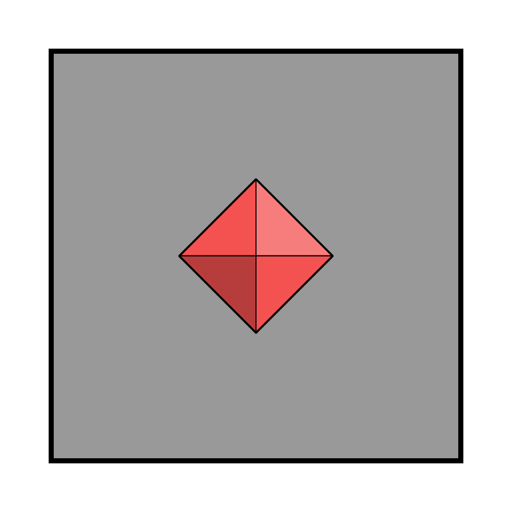

# Astorrel Member

|  | |
| --- | --- |
| Civilisation | [Kingdom of Astor](../../../README.md) |
| Organisation | [Astorrel](../README.md) |
| Officer? | No |
| Commanding Officers | [Astorrel Lieutenants](5-lieutenant.md) |
| Subordinates | None |

# Military Badge

*See also: [Military badges](../../../military-badges.md)*

Astorrel Member badges are the plain [Astorrel](../README.md) military badge, with no lines denoting rank. It is understood that a plain badge means the lowest rank.

# Duties

Astorrel Members are any [Astorrel](../README.md) that are not skilled enough to engage in missions.

They perform duties within [Astorrel](../README.md) strongholds exclusively. This can include guard duty, tidying and cleaning, inventory and bookkeeping.

# Pay

Astorrel Members are paid a weekly salary.

# Promotion

Typically speaking, members are never promoted. This is because they haven't proven themselves to be capable of completing missions, and mission completing ranks are needed to progress further up the chain of command.

It is rare, but occasionally members that improve their skills on their own time can be promoted to [Astorrel Squad Hand](2-squad-hand.md).
