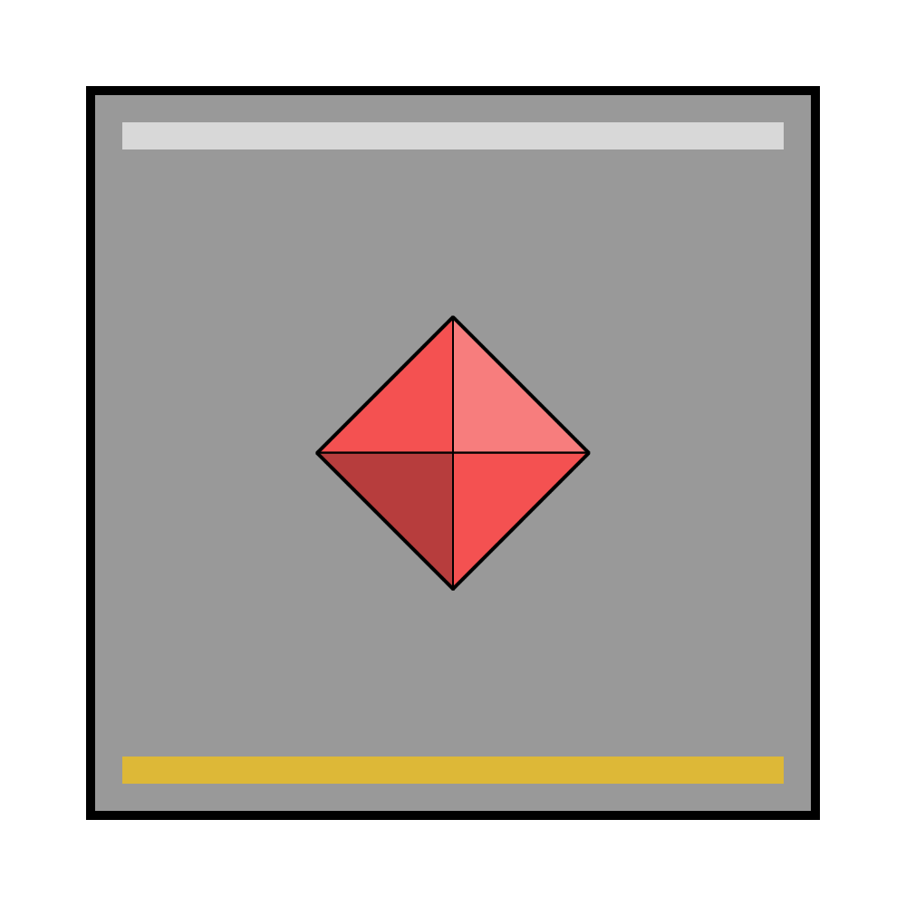

# Astorrel Lieutenant

|  | |
| --- | --- |
| Civilisation | [Kingdom of Astor](../../../README.md) |
| Organisation | [Astorrel](../astorrel.md) |
| Officer? | Yes |
| Commanding Officers | [Astorrel Captains](6-captain.md) |
| Subordinates | [Astorrel Squad Sergeants](4-squad-sergeant.md) |

# Military Badge

*See also: [Military badges](../../../military-badges.md)*

Astorrel Lieutenant badges look like plain [Astorrel](../astorrel.md) [military badges](../../../military-badges.md), but with a strip of gold inlaid inside its bottom edge, and a strip of silver inlaid inside its top edge. The use of gold denotes an officer rank.

# Duties

Astorrel Lieutenants create missions which they pass to their subordinate [Astorrel Squad Sergeants](4-squad-sergeant.md). They also decide on the mission bounty out of their budget.
