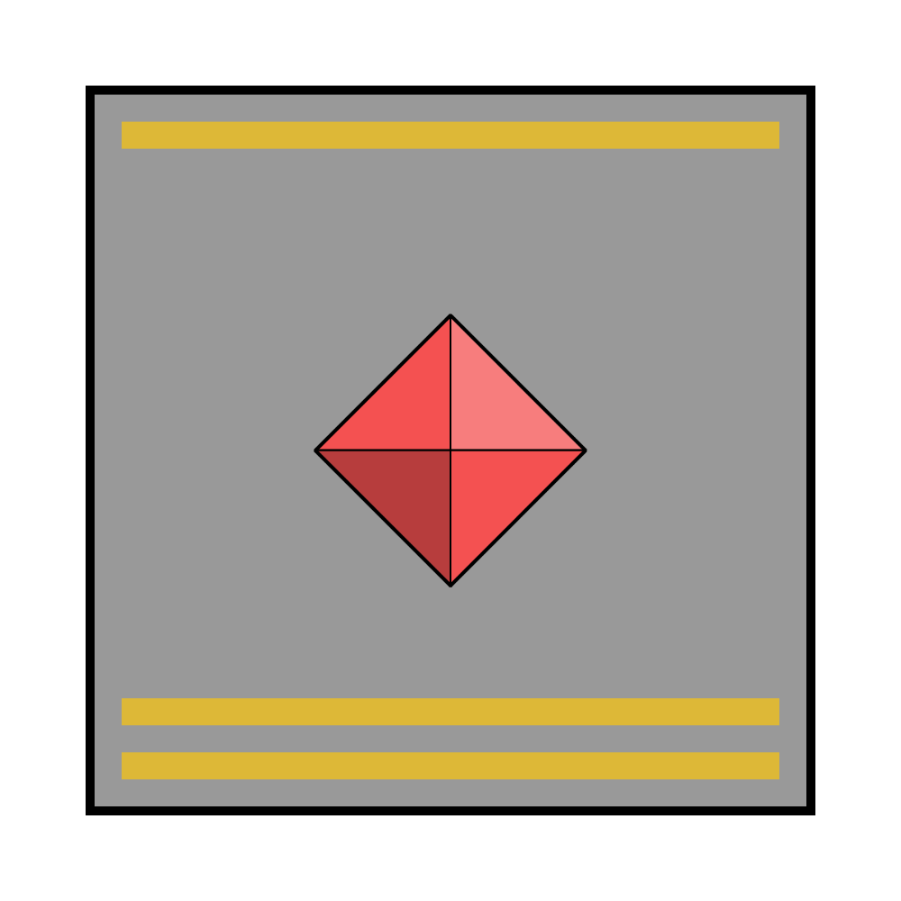

# Astorrel Major

|  | |
| --- | --- |
| Civilisation | [Kingdom of Astor](../../../README.md) |
| Organisation | [Astorrel](../README.md) |
| Officer? | Yes |
| Commanding Officers | Astorrel Commandant |
| Subordinates | Astorrel Lieutenants |

# Military Badge

*See also: [Military badges](../../../military-badges.md)*

Astorrel Major badges look like plain [Astorrel](../README.md) [military badges](../../../military-badges.md), but with a strip of gold inlaid inside its top edge, and a double strip of gold inlaid inside its bottom edge. The use of gold denotes an officer rank.

# Duties

Astorrel Majors are specialised leaders that oversee a facet of the Astorrel. They have multiple Astorrel Lieutenants working for them to achieve their goals.

Majors have varied responsibilities:

- Broad decisions on how to look after the balance of nature and civilisation (which informs the missions that Lieutenants create).
- Training new recruits through the Astorrel training programme (their Lieutenants are mentors to the trainees).
- Other new initiatives regarding unknown phenomena and potential threats.
