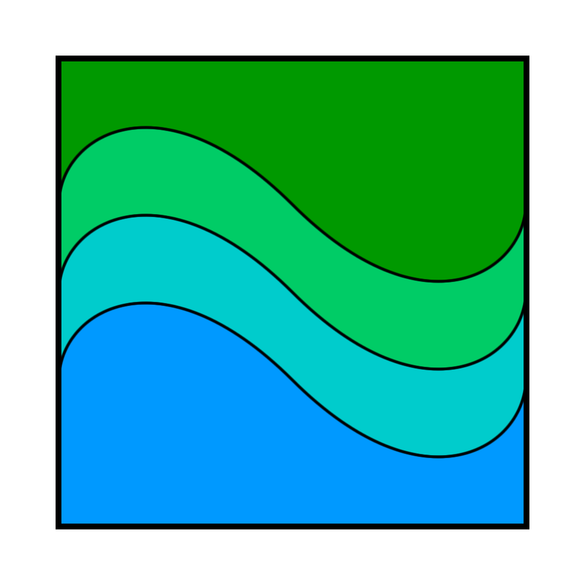

# Kirrel

> All that we are and can be comes from the ground. Kirrel’s gifts allow us to prosper.

|  | |
| --- | --- |
| **Pantheon** | Insider gods |
| **Religion** | [The Order of the Diamond](../the-order-of-the-diamond.md) |
| **Deity** | Lesser |
| **Domains** | Nature, Tempest |
| **Gender** | Variant |
| **Nickname** | *The Generous* |
| **Associations** | Health, Generosity, Fortune |

## Teachings

Kirrel reminds people that nature’s bounty allows society to thrive, and so it must be listened to, nurtured and preserved. Like the forest and the sea, its followers are generous and kind, offering hospitality to any in need.

## Imagery

### Symbol

Their symbol is a square partitioned by three wave-shaped lines. The top section is green, the bottom is blue, and the sections in between are teal.

### Representation

They are represented as a grass snake with green, blue, and teal markings.

## Worship

*See also: [Astorian Calendar](../../history/astorian-calendar.md)*

- Religious day: Kirdag
- Festival: summer
