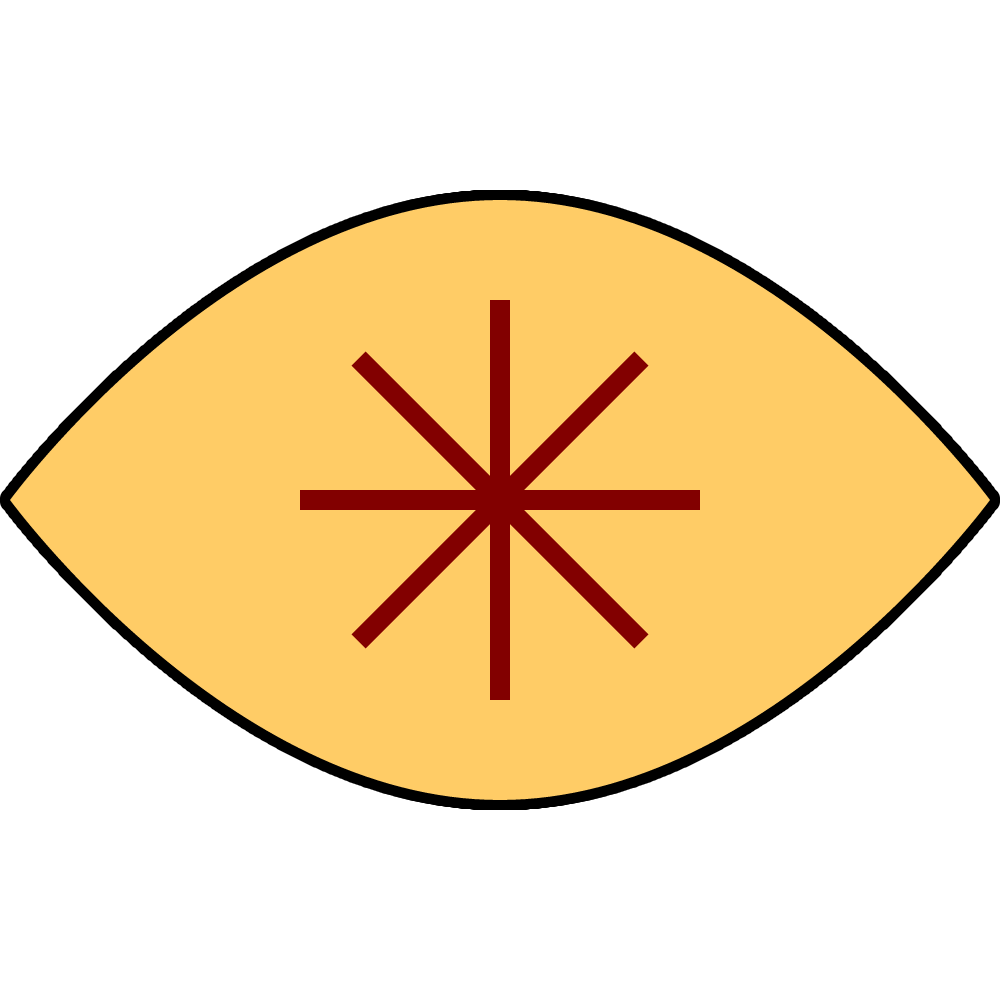

# Valnos

> We are better than our ancestors. Valnos will show us the way.

|  | |
| --- | --- |
| **Pantheon** | Insider gods |
| **Religion** | [The Order of the Diamond](../the-order-of-the-diamond.md) |
| **Deity** | Lesser |
| **Domains** | Knowledge, Light |
| **Gender** | Female |
| **Nickname** | *The Bestower* |
| **Associations** | Loyalty, Servitude, Curiosity. |

## Teachings

Valnos is the persistent advancement of society, determined to create a better tomorrow for all. She also represents commitment to the cause, instilling in her followers a sense of duty and obligation that makes them particularly tenacious.

## Imagery

### Symbol

Her symbol is an eye shape (pointed oval) in yellow or gold, with an eight-pointed star at its centre.

### Representation

She is represented by a large bird of prey, wings wide and pushed forward. She is said to glow, so shiny gold or copper metals are used, or even gems.

## Worship

*See also: [Astorian Calendar](../../history/astorian-calendar.md)*

- Religious day: Valdag
- Festival: spring
