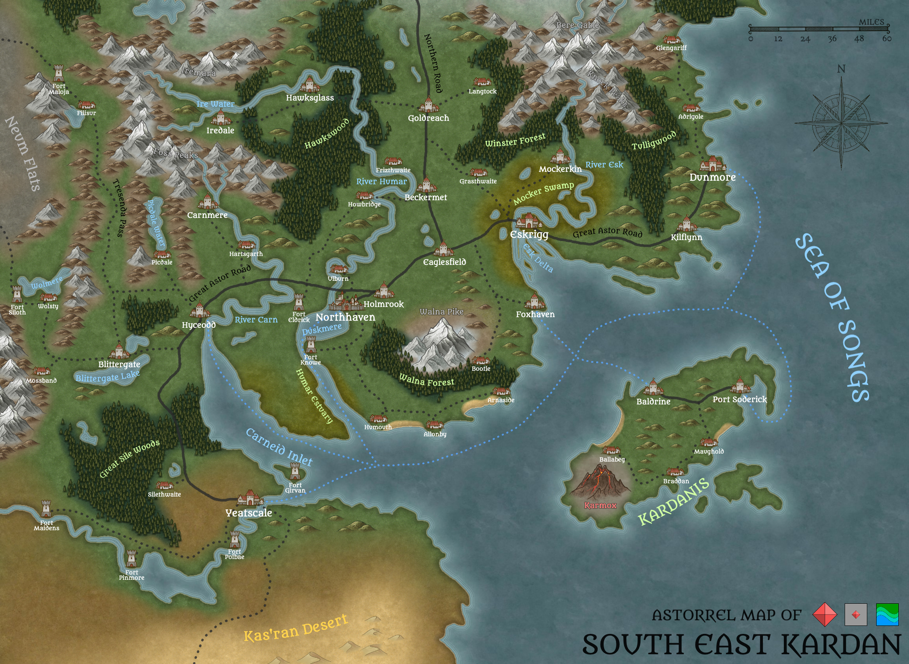

# Astorrel Map of South East Kardan

## Summary

The Astorrel Map of South East Kardan is a standard issue map given to [Astorrel](../civilisations/kingdom-of-astor/organisations/astorrel/astorrel.md) squads.

## Versions

| Large (6.6 MB) | Large with Hex Grid (7.3 MB) | [Player](../../players/logan.md) (2 MB) |
| --- | --- | --- |
|  |  |  |
