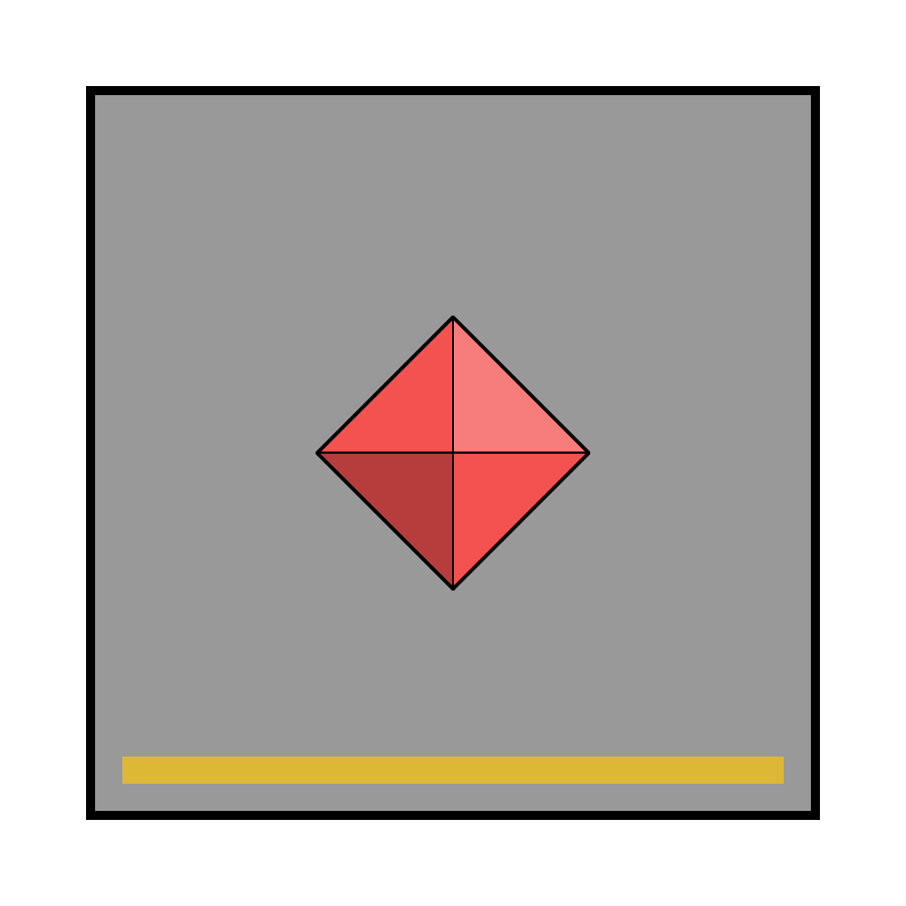

# Bryce Morton

|  | |
| --- | --- |
| **Name** | Bryce Morton |
| **Race** | Human |
| **Gender** | Male |
| **Age** | 44 |
| **Class** | Fighter |
| **Alignment** | Lawful Neutral |
| **Affiliation** | [Astorrel Squad Sergeant](../civilisations/kingdom-of-astor/organisations/astorrel/ranks/4-squad-sergeant.md)  |
| **Commanding Officer** | [Samantha Ilis](samantha-ilis.md) |
| **Subordinates** | [Canary Squad](../civilisations/kingdom-of-astor/organisations/astorrel/squads/canary.md) [Crimson Squad](../civilisations/kingdom-of-astor/organisations/astorrel/squads/ruby.md) |
| **Worship** | [Kirrel](../gods/gods/kirrel.md) |
| **Relations** | |
| **Acquaintances** | |
| **From** | |
| **Places** | |

## Summary

Bryce Morton is an [Astorrel Squad Sergeant](../civilisations/kingdom-of-astor/organisations/astorrel/ranks/4-squad-sergeant.md) working for the [Northhaven](../places/cities/northhaven.md) [Astorrel](../civilisations/kingdom-of-astor/organisations/astorrel/astorrel.md). He provides missions to [Canary Squad](../civilisations/kingdom-of-astor/organisations/astorrel/squads/canary.md) and [Crimson Squad](../civilisations/kingdom-of-astor/organisations/astorrel/squads/ruby.md).

He is a career [Astorrel](../civilisations/kingdom-of-astor/organisations/astorrel/astorrel.md), looking for promotion. Despite this his methods are very hands-off, preferring to let his squads get on with their missions alone, and getting irritated when his assistance is called upon. His preference would be to stay inside of the [Northhaven Astorrel stronghold](../places/strongholds/northhaven-astorrel-stronghold.md).

He is a straightforward person with a military personality. He stands to attention and talks straightforwardly. In his quarters he can also be stern or pensive.

## Characteristics

| Appearance | Description |
| --- | --- |
| Face | Dark skin, chiseled jaw, stern prominent eyebrows. |
| Hair | Brown, greying slightly, particularly on sides. Short sides and combed flick over. |
| Body | 5'11", somewhat muscly. Good posture. |
| Clothes | [Astorrel](../civilisations/kingdom-of-astor/organisations/astorrel/astorrel.md) officer's uniform. |
| Equipment | Ceremonial sword. |
| Mannerisms | Either stands to attention, or leans forward on his desk with his elbows. |

| Personality | Description |
| --- | --- |
| Voice | Deep, somewhat stern. |
| Quirks | He is a motivated [Astorrel](../civilisations/kingdom-of-astor/organisations/astorrel/astorrel.md) with career aspirations, but wants those he commands to complete their missions with as little of his input as possible. |
| Knowledge | Knows the inner workings of the [Astorrel](../civilisations/kingdom-of-astor/organisations/astorrel/astorrel.md) well. |
| Values | Loyalty, commitment to the cause, trouble-free mission successes. |
| Ambitions | Wishes to be promoted to Lieutenant before retiring. |
| Dislikes | Complications, leaving his office/residence, exerting himself. |

## History

While a Squad Lead, his squad was called **Summit Squad**.

### [Astorrel Graduation](../../campaigns/astorrel-agents/storylines/astorrel-graduation.md)

The [Astorrel Agents](../../campaigns/astorrel-agents/README.md) party goes to [Bryce Morton's Office](../places/buildings/bryce-mortons-office.md) to meet their new superior officer. Under his direction, they become [Canary Squad](../civilisations/kingdom-of-astor/organisations/astorrel/squads/canary.md), alongside [Crimson Squad](../civilisations/kingdom-of-astor/organisations/astorrel/squads/ruby.md).
