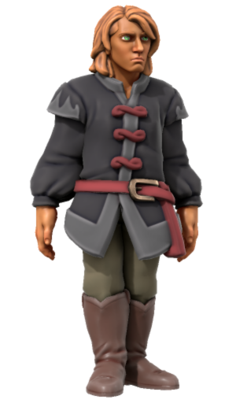

# Clay Mullen

|  | |
| --- | --- |
| **Name** | Clay Mullen |
| **Race** | Human |
| **Gender** | Male |
| **Age** | 33 |
| **Class** | |
| **Alignment** | |
| **Affiliation** | Drigg |
| **Worship** | |
| **Relations** | |
| **Acquaintances** | |
| **From** | |
| **Places** | |

## Summary

Clay Mullen is a coach driver available for hire.

He typically works between the cities of [Northhaven](../places/cities/northhaven.md) and [Eskrigg](../places/cities/eskrigg.md), but finds the work dull and is happy to be hired to different places providing he knows the roads well enough.

His horse is called Secret.

## Characteristics

| Appearance | Description |
| --- | --- |
| Face | Tanned and weather worn from a life riding on the road. |
| Hair | Scraggly ginger hair, slight beard. |
| Body | 5'7" / 170cm. Thin but muscular arms from riding. |
| Clothes | Slightly formal dark button-up shirt, trousers. |
| Mannerisms |  |

| Personality | Description |
| --- | --- |
| Voice | Normal male register. Straight talking. |
| Quirks | Willing to take a different route to break up his otherwise dull routine, but uneasy about taking an unfamiliar route. |
| Knowledge | Riding, map reading. |
| Values | |
| Ambitions | |
| Dislikes | |

## History

### [AA02](../../campaigns/astorrel-agents/sessions/AA02.md)

[Canary Squad](../civilisations/kingdom-of-astor/organisations/astorrel/squads/canary.md) hired Clay to drive them to [Arnaside](../places/villages/arnaside.md) for their mission (Investigate Logging in [Arnaside](../places/villages/arnaside.md)). After Ahsha haggled with him, he agreed to make the journey for 5 gp, and would offer the return journey at the same rate.

When bandits ambushed the coach by placing a dead horse in the road, Clay was sliced at by a bandit that jumped on the front of the cart, rendering him unconscious. [Ephaine Seren](ephaine-seren.md) managed to stabilise him with Healing Word.

Following the fight, he was in too bad a condition to drive and was placed in the back of the coach to rest. The party opted to stop overnight in [Humouth](../places/villages/humouth.md) so that he could rest in The Keeper's Reprise (inn).

## Planning

### [Astorrel Agents](../../campaigns/astorrel-agents/astorrel-agents.md)

In the morning Clay will have second thoughts about agreeing to this journey, wishing to head back to [Northhaven](../places/cities/northhaven.md) where he can recover fully.

He will insist on driving himself, arguing that if the party is paying him, they should not be driving.

At [Arnaside](../places/villages/arnaside.md) he will offer to stay for one night if the party wishes taking back, otherwise they will have to make their own way. He tries to sleep on top of his coach as before, but if the winds are strong on any given night he either sleeps inside, or enters the [Head & Haft](../places/buildings/inns-taverns/head-and-haft.md) for shelter.
