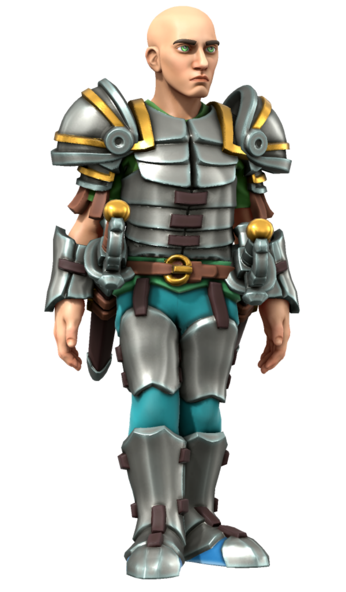
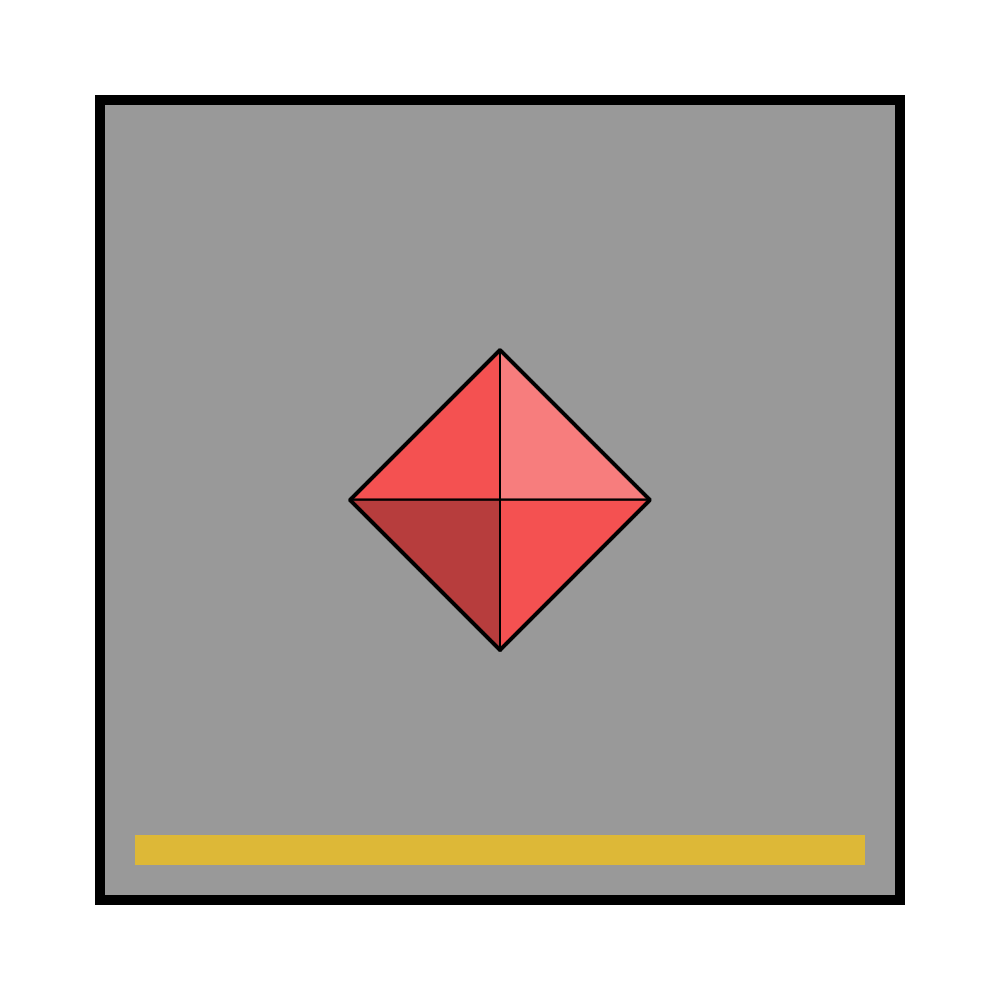

# Garrick Rose

| | |
| --- | --- |
| **Name** | Garrick Rose | person.2
| **Race** | Human |
| **Gender** | Male |
| **Age** | 35 |
| **Class** | |
| **Worship** | |
| **Relations** | |
| **Places** | [Northhaven Astorrel Stronghold](../places/strongholds/northhaven-astorrel-stronghold.md) [The Sanctum](../places/buildings/the-sanctum.md) |
| | |
| **Citizenship** | [Kingdom of Astor](../civilisations/kingdom-of-astor/README.md) |
| **Organisation** | [Astorrel](../civilisations/kingdom-of-astor/organisations/astorrel/astorrel.md) |
| **Rank** | [Astorrel](../civilisations/kingdom-of-astor/organisations/astorrel/astorrel.md) Guard Sergeant  |
| **Role** | City / [Northhaven](../places/cities/northhaven.md) |
| **Commanding Officer** | |
| **Subordinates** | Graf Stozitsk Sesen Nusk |

## Summary

Garrick Rose is an [Astorrel](../civilisations/kingdom-of-astor/organisations/astorrel/astorrel.md) Guard Sergeant attached to the [Northhaven Astorrel Stronghold](../places/strongholds/northhaven-astorrel-stronghold.md).

## Characteristics

| | |
| --- | --- |
| **Face** | Pale, furrowed brow, stern look, crooked nose. Green eyes. | characteristics.2
| **Hair** | Shaved head (balding), dark eyebrows. |
| **Body** | 6'0" / 183cm. Lean. |
| **Clothes** | [Astorrel](../civilisations/kingdom-of-astor/organisations/astorrel/astorrel.md) guard sergeant's uniform. |
| **Voice** | Male register, gravelly. |
| **Mannerisms** | Rigid, stands to attention. Formal. |
| | |
| **Quirks** | |
| **Knowledge** | |
| **Values** | |
| **Ambitions** | |
| **Dislikes** | |

## History

## Planning

### [Purple Rain](../../campaigns/purple-rain/purple-rain.md)

Garrick meets the party as they attempt to seek [sanctuary](../civilisations/kingdom-of-astor/organisations/astorrel/sanctuary.md) in the [Northhaven Astorrel Stronghold](../places/strongholds/northhaven-astorrel-stronghold.md) with the help of [Sparrow on the Autumn Pine](sparrow-on-the-autumn-pine.md).

He accepts their request for [sanctuary](../civilisations/kingdom-of-astor/organisations/astorrel/sanctuary.md), briefly explaining the terms of [sanctuary](../civilisations/kingdom-of-astor/organisations/astorrel/sanctuary.md) to the party before moving them into [The Sanctum](../places/buildings/the-sanctum.md).

Following this he is posted outside of their quarters in the [sanctuary](../civilisations/kingdom-of-astor/organisations/astorrel/sanctuary.md), unable to leave his post unless he rescinds the offer of [sanctuary](../civilisations/kingdom-of-astor/organisations/astorrel/sanctuary.md). He checks on the party while bringing them their two daily meals. He also offers to help them within reason if they use the bells to contact him.

Garrick largely allows everyone to visit him, but refuses access to [Goshawk Squad](../civilisations/kingdom-of-astor/organisations/astorrel/squads/goshawk.md) due to their closeness to the events leading up to [sanctuary](../civilisations/kingdom-of-astor/organisations/astorrel/sanctuary.md).
