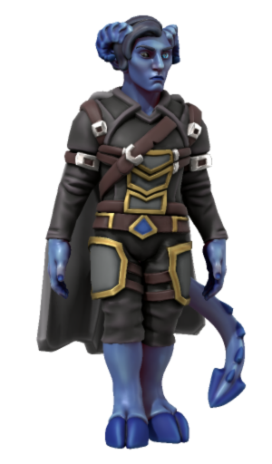
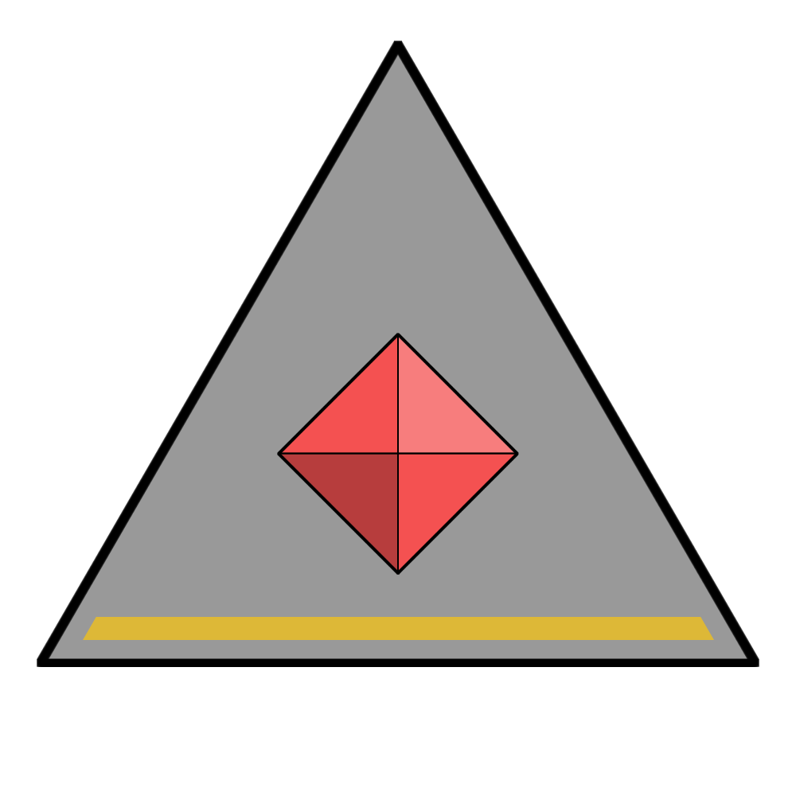

# Kur Merkys

|  | |
| --- | --- |
| **Name** | Kur Merkys |
| **Race** | Tiefling |
| **Gender** | Male |
| **Age** | 22 |
| **Class** | Sorcerer (Draconic Bloodline) |
| **Alignment** | |
| **Affiliation** | [Astornox Lieutenant](../civilisations/kingdom-of-astor/organisations/astornox/ranks/4-lieutenant.md): Hunter  |
| **Commanding Officer** | |
| **Subordinates** | |
| **Worship** | [Gormox](../gods/gods/gormox.md) |
| **Relations** | |
| **Acquaintances** | [Vilnia Kovas](vilnia-kovas.md) ([Astorrel](../civilisations/kingdom-of-astor/organisations/astorrel/astorrel.md) Hunter) |
| **From** | |
| **Places** | [Northhaven](../places/cities/northhaven.md) |

## Summary

Kur Merkys is an [Astorrel](../civilisations/kingdom-of-astor/organisations/astorrel/astorrel.md) Hunter based out of [Northhaven](../places/cities/northhaven.md).

## Characteristics

| Appearance | Description |
| --- | --- |
| Face | Blue skin, prominent nose. Full black right eye, draconic light blue left eye. Small ram horns curling backwards. |
| Hair | Black with slight ash blue hue, entirely on right side, short bob length. |
| Body | 6'1" / 185cm. Hooves and tiefling tail. Thin and muscular. |
| Clothes | Black leathers with dark leather belts. Gold trimmed metal panelling cover middle of chest and thighs. Grey knee-length cape. No footwear. |
| Mannerisms | Feral and highly animated. Crawls on all fours at times. |

| Personality | Description |
| --- | --- |
| Voice | Male register. Snarly eastern European. |
| Quirks | Very unhinged due to their partial draconic lineage. |
| Knowledge | Speaks draconic. |
| Values | |
| Ambitions | |
| Dislikes | |

## History

## Planning

### [Purple Rain](../../campaigns/purple-rain/purple-rain.md)

Just before reaching the [Northhaven Astorrel Stronghold](../places/strongholds/northhaven-astorrel-stronghold.md), the party will face Kur Merkys and [Vilnia Kovas](vilnia-kovas.md) as they ambush the party to apprehend them.
