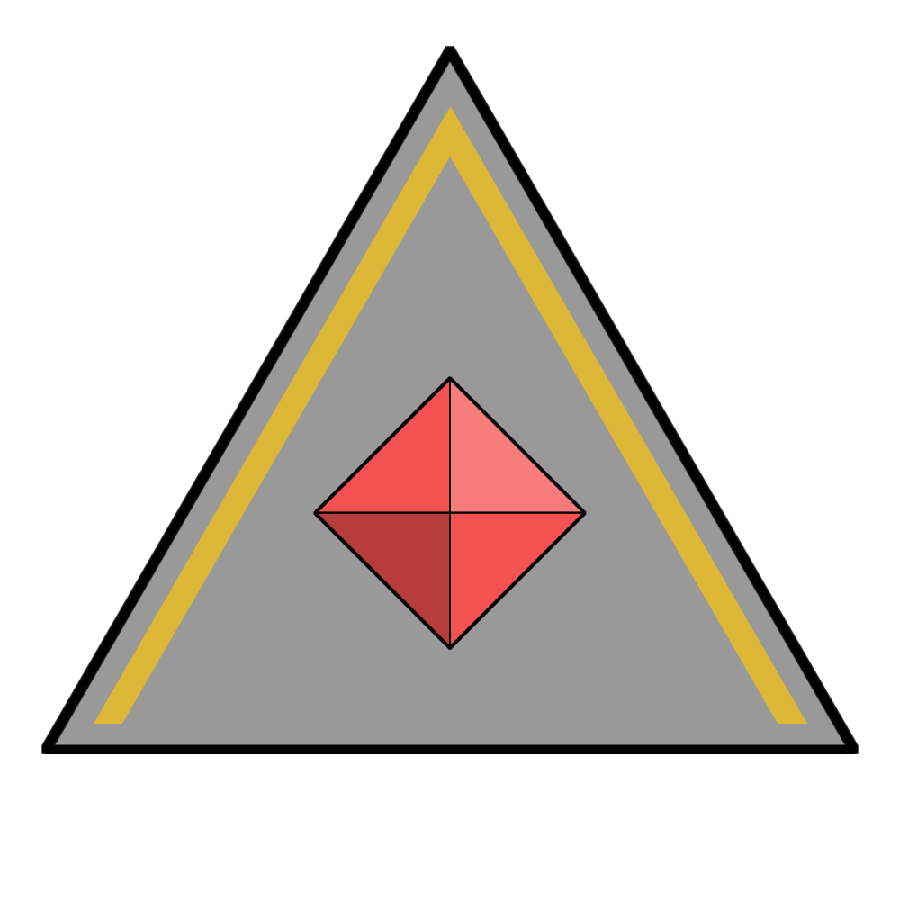

# Legacy Aranius

|  | |
| --- | --- |
| **Name** | Legacy Aranius |
| **Race** | Tiefling |
| **Gender** | Male |
| **Age** | |
| **Class** | |
| **Alignment** | |
| **Affiliation** | [Astornox Major](../civilisations/kingdom-of-astor/organisations/astornox/ranks/6-major.md): [Eskrigg](../places/cities/eskrigg.md)  |
| **Commanding Officer** | |
| **Subordinates** | |
| **Worship** | |
| **Relations** | |
| **Acquaintances** | |
| **From** | |
| **Places** | [Eskrigg](../places/cities/eskrigg.md) |

## Summary

Legacy Aranius is the [Astornox Major](../civilisations/kingdom-of-astor/organisations/astornox/ranks/6-major.md) of [Eskrigg](../places/cities/eskrigg.md).

## Characteristics

| Appearance | Description |
| --- | --- |
| Face | |
| Hair | |
| Body | |
| Clothes | |
| Mannerisms | |

| Personality | Description |
| --- | --- |
| Voice | |
| Quirks | |
| Knowledge | |
| Values | |
| Ambitions | |
| Dislikes | |

## History

## Planning

### Campaign Name
