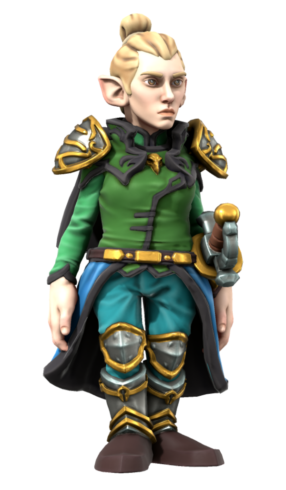
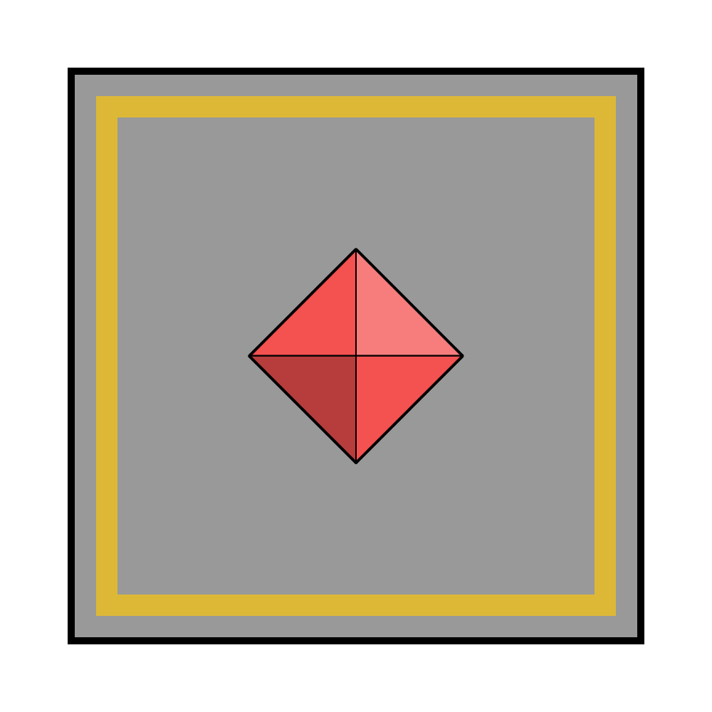

# Levelle Tristwix

|  | |
| --- | --- |
| **Name** | Levelle Tristwix |
| **Race** | Halfling |
| **Gender** | Non-binary |
| **Age** | 57 |
| **Class** | Druid |
| **Alignment** | Lawful Good |
| **Affiliation** | [Astorrel Commandant](../civilisations/kingdom-of-astor/organisations/astorrel/ranks/8-commandant.md)  |
| **Commanding Officer** | |
| **Subordinates** | [Merkin Thorgus](merkin-thorgus.md) ([Northhaven](../places/cities/northhaven.md)) |
| **Worship** | [Kirrel](../gods/gods/kirrel.md) |
| **Relations** | |
| **Acquaintances** | [Grant Thackeray](grant-thackeray.md) (old squad-mate, friend) |
| **From** | |
| **Places** | [Zenith Spire](../places/buildings/zenith-spire.md) [Northhaven Astorrel Stronghold](../places/strongholds/northhaven-astorrel-stronghold.md) |

## Summary

Levelle Tristwix is the [Astorrel Commandant](../civilisations/kingdom-of-astor/organisations/astorrel/ranks/8-commandant.md) in charge of the organisation's day-to-day operations.

She is a politically savvy commandant who is a big believer in the [Astorrel](../civilisations/kingdom-of-astor/organisations/astorrel/README.md). Despite her slow and posh manner of speaking, she easily commands a room. She'd like to see less conflict with the [Astornox](../civilisations/kingdom-of-astor/organisations/astornox/README.md).

## Characteristics

| Appearance | Description |
| --- | --- |
| Face | Pointed features, focused eyes, eye wrinkles. |
| Hair | Fair blonde, topknot. |
| Body | 3'3" (tall for a halfling), medium build. |
| Clothes | [Astorrel](../civilisations/kingdom-of-astor/organisations/astorrel/README.md) officer's uniform. |
| Equipment | Ceremonial rapier. |
| Mannerisms | Slow and purposeful. Understated. |

| Personality | Description |
| --- | --- |
| Voice | Posh and slow. |
| Quirks | Easily commands a room despite her size and slow speech. |
| Knowledge | The natural world, political savvy. |
| Values | Duty to the [Astorrel](../civilisations/kingdom-of-astor/organisations/astorrel/README.md), nature. |
| Ambitions | Less conflict with the [Astornox](../civilisations/kingdom-of-astor/organisations/astornox/README.md). |
| Dislikes | Time wasters. |

## History

While a Squad Lead, her squad was called **Acre Squad**. [Grant Thackeray](grant-thackeray.md) was a Squad Hand in this squad. They remain old friends to this day.

### [Astorrel Graduation](../../campaigns/astorrel-agents/storylines/astorrel-graduation.md)

Levelle Tristwix conducted the graduation of the [Astorrel Agents](../../campaigns/astorrel-agents/README.md) party, alongside [Merkin Thorgus](merkin-thorgus.md). They pinned each [Astorrel Squad Hand](../civilisations/kingdom-of-astor/organisations/astorrel/ranks/2-squad-hand.md) badge on the party members, and shook their hand.

After the graduation presentation, Levelle caught up with [Grant Thackeray](grant-thackeray.md). Together they said hi to [Redwyn Humpledopper](redywn-humpledopper.md), who ignored Levelle.
