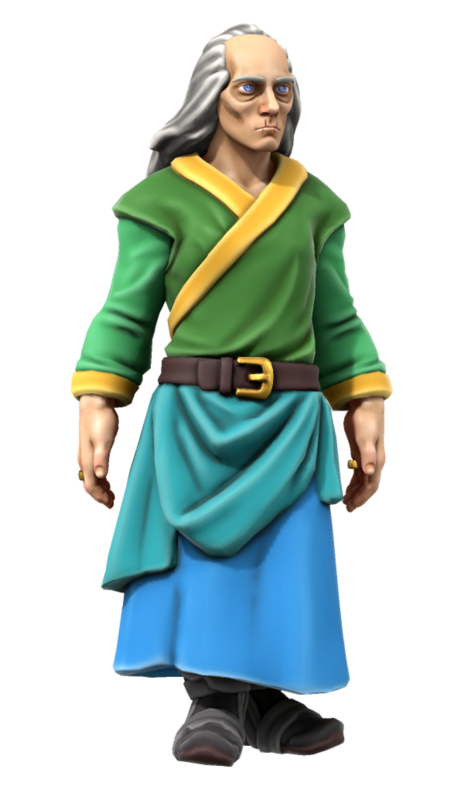

# Mergin Thorgus

| | |
| --- | --- |
| **Name** | Mergin Thorgus | person.2
| **Race** | Human |
| **Gender** | Male |
| **Age** | 87 |
| **Class** | Wizard |
| **Worship** | [Kirrel](../gods/gods/kirrel.md) |
| **Relations** | |
| **Places** | [Zenith Spire](../places/buildings/zenith-spire.md) [Northhaven Astorrel Stronghold](../places/strongholds/northhaven-astorrel-stronghold.md) |
| | |
| **Citizenship** | [Kingdom of Astor](../civilisations/kingdom-of-astor/README.md) |
| **Organisation** | [Astorrel](../civilisations/kingdom-of-astor/organisations/astorrel/astorrel.md) |
| **Rank** | [Astorrel Captain](../civilisations/kingdom-of-astor/organisations/astorrel/ranks/6-captain.md)  |
| **Role** | City / [Northhaven](../places/cities/northhaven.md) |
| **Commanding Officer** | |
| **Subordinates** | [Norsha Costello](norsha-costello.md) [Samantha Ilis](samantha-ilis.md) |

## Summary

Mergin is an old man with a beard that really ought to have retired already, but nobody dares tell him. Still, he stubbornly continues on diligently with his duties.

## Characteristics

| | |
| --- | --- |
| **Face** | Countless wrinkles, sagging eye bags, sunken blue eyes. | characteristics.2
| **Hair** | Long and grey knotted at its end. Receding hairline. |
| **Body** | 5'10". Withered and frail. Bad posture. |
| **Clothes** | [Astorrel robes](../civilisations/kingdom-of-astor/organisations/astorrel/uniforms/astorrel-robes.md) (officer) |
| **Voice** | Stereotypically old man. Shaky speech at times. |
| **Mannerisms** | Slow and purposeful. Understated. Uses their large wooden staff as a walking stick. |
| | |
| **Quirks** | Probably the oldest person you've ever seen. |
| **Knowledge** | History, the natural world. Can struggle to recall knowledge. |
| **Values** | Good conversation, a patient listener. |
| **Ambitions** | Continue to lead the [Northhaven](../places/cities/northhaven.md) [Astorrel](../civilisations/kingdom-of-astor/organisations/astorrel/astorrel.md) for as long as he can. |
| **Dislikes** | Dishonesty, people who can't hold a conversation. |

## History

### [Astorrel Graduation](../../campaigns/astorrel-agents/storylines/astorrel-graduation.md)

Mergin Thorgus conducted the graduation of the [Astorrel Agents](../../campaigns/astorrel-agents/astorrel-agents.md) party, alongside [Levelle Tristwix](levelle-tristwix.md). He gave each party member their graduation purse and bowed.

## Planning

### [Purple Rain](../../campaigns/purple-rain/purple-rain.md)

Mergin visits the party in [sanctuary](../civilisations/kingdom-of-astor/organisations/astorrel/sanctuary.md) to introduce themselves as the face of the [Northhaven Astorrel Stronghold](../places/strongholds/northhaven-astorrel-stronghold.md). They are curious and wish to know who the party are for their own satisfaction.

Mergin brings that day's town crier script ([Northhaven Town Crier Script 312-5-06](../../campaigns/purple-rain/papers/northhaven-town-crier-script-312-5-06.md)) with them, noting their notoriety. This gives the party an insight into what others are hearing about them.
