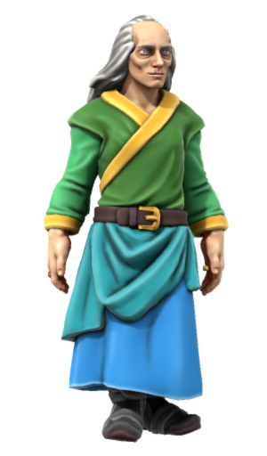
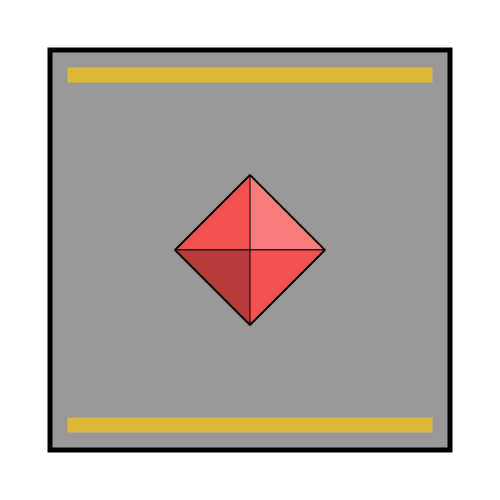

# Merkin Thorgus

|  | |
| --- | --- |
| **Name** | Merkin Thorgus |
| **Race** | Human |
| **Gender** | Male |
| **Age** | 87 |
| **Class** | Wizard |
| **Alignment** | Lawful Good |
| **Affiliation** | [Astorrel Captain](../civilisations/kingdom-of-astor/organisations/astorrel/ranks/6-captain.md): [Northhaven](../places/cities/northhaven.md)  |
| **Commanding Officer** | [Levelle Tristwix](levelle-tristwix.md) |
| **Subordinates** | |
| **Worship** | [Kirrel](../gods/gods/kirrel.md) |
| **Relations** | |
| **Acquaintances** | |
| **From** | |
| **Places** | [Zenith Spire](../places/buildings/zenith-spire.md) [Northhaven Astorrel Stronghold](../places/strongholds/northhaven-astorrel-stronghold.md) |

## Summary

Merkin Thorgus is the [Astorrel Captain](../civilisations/kingdom-of-astor/organisations/astorrel/ranks/6-captain.md) in charge of the [Northhaven](../places/cities/northhaven.md) [Astorrel](../civilisations/kingdom-of-astor/organisations/astorrel/astorrel.md).

He is an old man with a beard that really ought to have retired already, but nobody dares tell him. Still, he stubbornly continues on diligently with his duties.

## Characteristics

| Appearance | Description |
| --- | --- |
| Face | Countless wrinkles, sagging eye bags, sunken blue eyes. |
| Hair | Long and grey knotted at its end. Receding hairline. |
| Body | 5'10". Withered and frail. Bad posture. |
| Clothes | [Astorrel](../civilisations/kingdom-of-astor/organisations/astorrel/astorrel.md) ceremonial, mostly due to weight and comfort. Gold coloured edges instead of black. |
| Equipment | Large wooden staff that doubles as a walking stick. |
| Mannerisms | Slow and purposeful. Understated. |

| Personality | Description |
| --- | --- |
| Voice | Stereotypically old man. Shaky speech at times. |
| Quirks | Probably the oldest person you've ever seen. |
| Knowledge | History, the natural world. Can struggle to recall knowledge. |
| Values | Good conversation, a patient listener. |
| Ambitions | Continue to lead the [Northhaven](../places/cities/northhaven.md) [Astorrel](../civilisations/kingdom-of-astor/organisations/astorrel/astorrel.md) for as long as he can. |
| Dislikes | Dishonesty, people who can't hold a conversation. |

## History

### [Astorrel Graduation](../../campaigns/astorrel-agents/storylines/astorrel-graduation.md)

Merkin Thorgus conducted the graduation of the [Astorrel Agents](../../campaigns/astorrel-agents/astorrel-agents.md) party, alongside [Levelle Tristwix](levelle-tristwix.md). He gave each party member their graduation purse and bowed.
