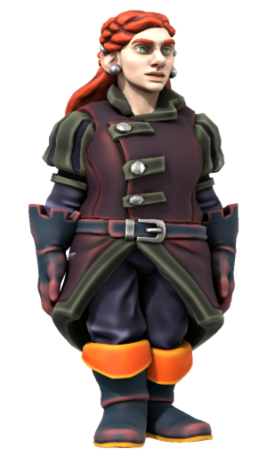

# Redwyn Humpledopper

|  | |
| --- | --- |
| **Name** | Redwyn Humpledopper |
| **Race** | Dwarf |
| **Gender** | Female |
| **Age** | 29 |
| **Class** | Bard |
| **Alignment** | Chaotic Neutral |
| **Affiliation** | [Astorrel Squad Hand](../civilisations/kingdom-of-astor/organisations/astorrel/ranks/2-squad-hand.md): [Canary Squad](../civilisations/kingdom-of-astor/organisations/astorrel/squads/canary.md)  |
| **Commanding Officer** | [Bryce Morton](bryce-morton.md) |
| **Subordinates** | |
| **Worship** | |
| **Relations** | Father Humpledopper (father, deceased) Mother Humpledopper (mother, deceased) Brother Humpledopper (brother) |
| **Acquaintances** | |
| **From** | Carnmere |
| **Places** | |

## Summary

Redwyn Humpledopper is a player character in the [Astorrel Agents](../../campaigns/astorrel-agents/astorrel-agents.md) campaign, played by [Logan](../../players/logan.md).

## Backstory

Redwyn Humpledopper was born in the town of Carnmere. They have a brother.

Their parents owned a tavern in Carnmere. Their family had a feud with the Waterstride family (halflings) who own The Rusty Spigot, a competing tavern.

One day Redwyn returned from foraging to find their family's tavern ransacked and their parents slain. There was no sign or trace of her brother. Due to the feud and these events, Redwyn has a distaste and distrust of halflings.

With little tying them to Carnmere anymore, Redwyn ventured out to attempt to join the [Astorrel](../civilisations/kingdom-of-astor/organisations/astorrel/astorrel.md) so that she could explore unseen lands and hopefully find a new purpose protecting her corner of the [Kingdom of Astor](../civilisations/kingdom-of-astor/README.md) from those who would do it harm.

### [Two Truths and a Lie](../../campaigns/astorrel-agents/two-truths-and-a-lie.md)

- They started a fight with one of their fellow trainees. [truth]
- They don't believe in any of the four gods and will pledge themselves to one of them in bad faith. [truth]
- The only reason they joined the [Astorrel](../civilisations/kingdom-of-astor/organisations/astorrel/astorrel.md) was for an opportunity at vengeance. [lie]

### [Astorrel Graduation](../../campaigns/astorrel-agents/storylines/astorrel-graduation.md)

Redwyn graduated into the [Astorrel](../civilisations/kingdom-of-astor/organisations/astorrel/astorrel.md) as an [Astorrel Squad Hand](../civilisations/kingdom-of-astor/organisations/astorrel/ranks/2-squad-hand.md). Her superior officer is [Bryce Morton](bryce-morton.md). She met up with the rest of the [Astorrel Agents](../../campaigns/astorrel-agents/astorrel-agents.md) party before meeting him for the first time. She joined [Canary Squad](../civilisations/kingdom-of-astor/organisations/astorrel/squads/canary.md) alongside [Crimson Squad](../civilisations/kingdom-of-astor/organisations/astorrel/squads/ruby.md).

She appears to have a thing for [Darius Dunn](darius-dunn.md).
