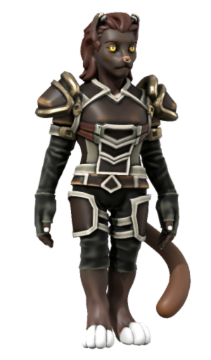

# Whisper on the Breeze

|  | |
| --- | --- |
| **Name** | Whisper on the Breeze |
| **Race** | Tabaxi |
| **Gender** | Non-binary |
| **Age** | 22 |
| **Class** | Rogue |
| **Alignment** | Chaotic Good |
| **Affiliation** | Clan on the Breeze [Astorrel Squad Hand](../civilisations/kingdom-of-astor/organisations/astorrel/ranks/2-squad-hand.md): [Canary Squad](../civilisations/kingdom-of-astor/organisations/astorrel/squads/canary.md)  |
| **Commanding Officer** | [Bryce Morton](bryce-morton.md) |
| **Subordinates** | |
| **Worship** | |
| **Relations** | [Shout on the Breeze](shout-on-the-breeze.md) (father) |
| **Acquaintances** | |
| **From** | Kuv'narash |
| **Places** | |

## Summary

Whisper on the Breeze is a player character in the [Astorrel Agents](../../campaigns/astorrel-agents/astorrel-agents.md) campaign, played by [Brooke](../../players/brooke.md).

## Backstory

Whisper on the Breeze was born in the town of Kuv'narash ([Syntenne Republic](../civilisations/syntenne-republic/README.md)) to [Shout on the Breeze](shout-on-the-breeze.md) (father) and their mother. They are the runt of a litter of 5 Tabaxi.

Their clan has always been moving, struggling to settle and integrate into the cultures they encountered. The clan's journey has taken the from their homelands in the [Nil'Savnic Alliance](../civilisations/nilsavnic-alliance/README.md), through the [Syntenne Republic](../civilisations/syntenne-republic/README.md), and finally up into the [Kingdom of Astor](../civilisations/kingdom-of-astor/README.md).

Once in Astor, Whisper's father abandoned the clan to join the [Astornox](../civilisations/kingdom-of-astor/organisations/astornox.md) in the city of [Yeatscale](../places/cities/yeatscale.md). Due to this the clan fell on harder times, causing Whisper to turn to stealing to make ends meet. This brought constant trouble to the clan, usually getting them kicked out of the towns they settled in.

Once in Astor they settled in the town of Hyceodd, their clan began settling in and had some luck getting ingrained into society. Whisper's stealing once again got them kicked out of town.

With this, the Clan on the Breeze could take it no longer, and abandoned Whisper in the wilderness, leaving them to fend for themselves. They began to live off the land, traveling east through Astor. Along the way they found imbalances in power and did their bit to restore the balance, the only way they knew how - stealing from the privileged.

### [Two Truths and a Lie](../../campaigns/astorrel-agents/two-truths-and-a-lie.md)

- They are originally from outside of the [Kingdom of Astor](../civilisations/kingdom-of-astor/README.md). [truth]
- Their father is an [Astornox](../civilisations/kingdom-of-astor/organisations/astornox.md). [truth]
- They believe very strongly in the [Astorrel](../civilisations/kingdom-of-astor/organisations/astorrel/astorrel.md) cause. [lie]

### [Astorrel Graduation](../../campaigns/astorrel-agents/storylines/astorrel-graduation.md)

Whisper graduated into the [Astorrel](../civilisations/kingdom-of-astor/organisations/astorrel/astorrel.md) as an [Astorrel Squad Hand](../civilisations/kingdom-of-astor/organisations/astorrel/ranks/2-squad-hand.md). Their superior officer is [Bryce Morton](bryce-morton.md). They met up with the rest of the [Astorrel Agents](../../campaigns/astorrel-agents/astorrel-agents.md) party before meeting him for the first time. They joined [Canary Squad](../civilisations/kingdom-of-astor/organisations/astorrel/squads/canary.md) alongside [Ruby Squad](../civilisations/kingdom-of-astor/organisations/astorrel/squads/ruby.md).
