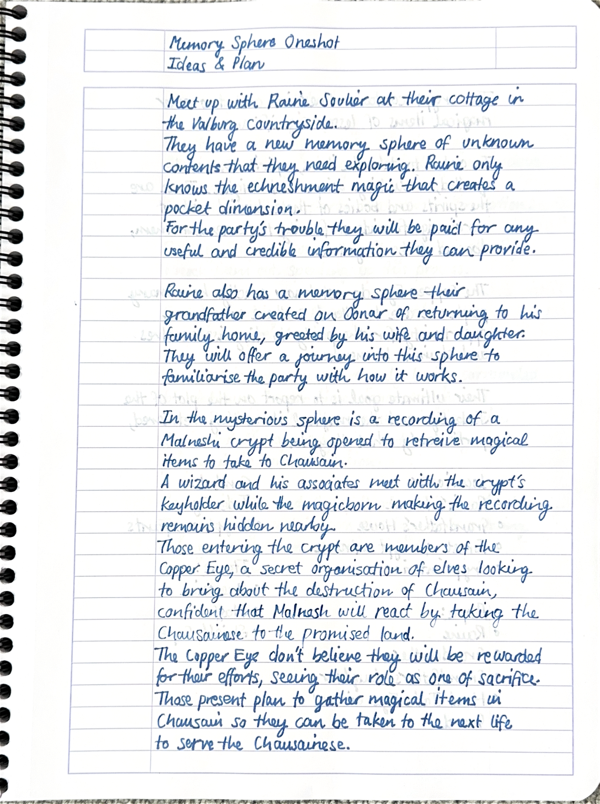
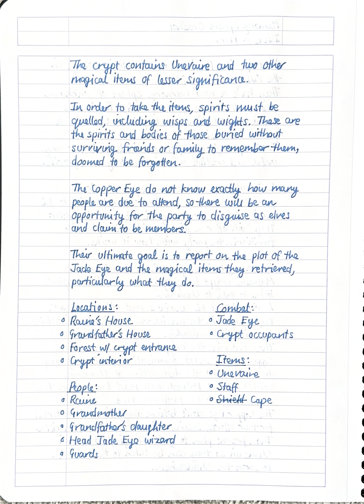
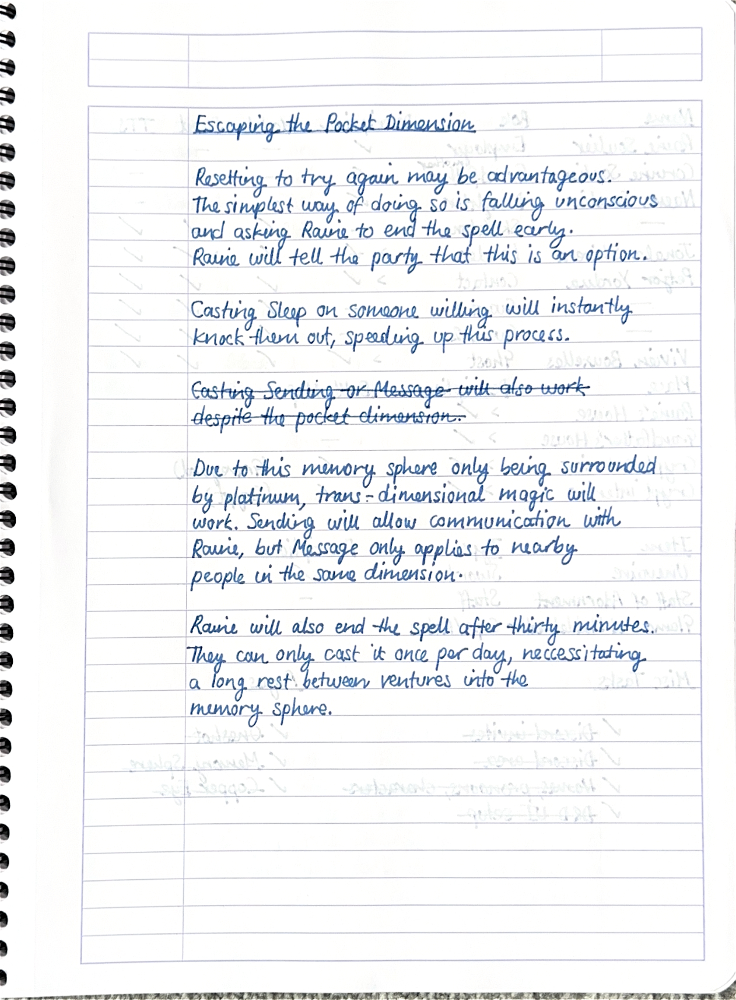
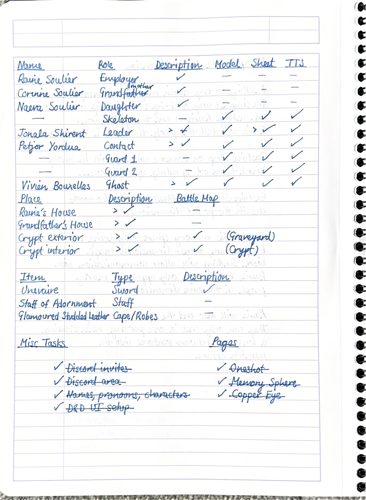

# Raine's Artifact

*Raine's Artifact* is the second oneshot set in the [Astarus](../celestial-objects/astarus.md) homebrew setting.

## Premise

> A group of adventurers answer the call of [Raine Soulier](../characters/raine-soulier.md): an enigmatic expert of magical artifacts from before [The Second Coming](../history/events/the-second-coming.md).
>
> Once at his family home in the idyllic hills of [Valburg](../civilisations/nilsavnic-alliance/states/valburg.md), he asks you all to investigate a device that holds memories and can project people into a pocket dimension, creating a historical snapshot to be explored...

## Sessions

| Session(s) | Date 1 | Date 2 |
|---| --- | --- |
| [RA01](../sessions/RA01.md) | 2021-10-09 | 2021-11-06 |
| [RA02](../sessions/RA02.md) | 2021-10-23 | 2021-11-14 |
| [RA03](../sessions/RA03.md) | 2021-12-19 | 2021-12-26 |
| [RA04](../sessions/RA04.md) | 2022-01-29 | 2022-03-06 |
| [RA05](../sessions/RA05.md) | 2022-03-12 | |
| [RA06](../sessions/RA06.md) | 2022-06-02 | 2022-07-03 |
| [RA07](../sessions/RA07.md) | TBC | |

---

## Oneshot Notes

| Character | Base | Image ID
| --- | --- | --- |
| Crypt Skeleton | [Skeleton](https://www.dndbeyond.com/monsters/skeleton) | `afb5195acb2087a1` |
| [Copper Eye](../organisations/copper-eye.md) Guard || `dcae962520ab09d9` |
| [Jonala Shirent](../characters/jonala-shirent.md) | [Character Sheet (3 players)](https://www.dndbeyond.com/profile/JessRising/characters/59601657) [Character Sheet (4 players)](https://www.dndbeyond.com/profile/JessRising/characters/64194957) ||
| [Vivien Bouxelles](../characters/vivien-bouxelles.md) | [Ghost](https://www.dndbeyond.com/monsters/ghost) ||
| Wisp | [Will-o'-Wisp](https://www.dndbeyond.com/monsters/will-o-wisp) ||

### [Raine's Cottage](../places/buildings/houses/raines-cottage.md)

- Party arrives at the behest of [Raine Soulier](../characters/raine-soulier.md).
- Raine wants [Mémoire de Cimetière](../items/echneshment/memory-spheres/memoire-de-cimetiere.md) investigating.
  - Explains what a [memory sphere](../items/echneshment/memory-spheres/memory-sphere.md) is.
  - Can create the pocket dimension once per day.
  - Party allowed to stay here as long as necessary.
    - Long rest each night.
    - Raine provides food.
- Investigation agreement:
  - Spell will be cast for 30 minutes.
  - Falling unconscious exits the pocket dimension.
  - Sending will allow communication with Raine.
  - If someone exits, they can have Raine end the spell early.

### [Soulier Cottage](../places/buildings/houses/soulier-cottage.md)

- Rene Soulier
  - [Raine Soulier](../characters/raine-soulier.md)'s ancestor.
  - Family see Raine as Rene.
- [Corinne Soulier](../characters/corinne-soulier.md)
  - Making shepherd's pie (minced beef and potato).
  - Not expecting to see Rene back from Chausain that day.
  - Hugs and kisses him.
  - Insists on serving dinner, everyone sitting around the table.
- [Naeva Soulier](../characters/naeva-soulier.md)
  - Learning to write, sat at the family table.
  - Calls Rene "daddy", happy to see him.

### [Dulsenn Graveyard](../places/structures/dulsenn-graveyard.md)

- Night, misty.
- [Jonala Shirent](../characters/jonala-shirent.md) waiting outside of mausoleum with two guards.
  - Half-expecting more [Copper Eye](../organisations/copper-eye.md) backup.
  - Must identify as [Copper Eye](../organisations/copper-eye.md):
    - "Who are you?" "I am forsaken".
    - Produce a [Copper Eye](../organisations/copper-eye.md) Coin.
  - Willing to kill to be successful this night.
- [Petjor Yordua](../characters/petjor-yordua.md) arrives with the key and a coin.
  - Opens the door.
- Jonala and Petjor head inside, guards wait outside.

### Dulsenn Crypt

- Pitch black.
- Coffins contain skeletons. Some others found in destroyed parts of crypt.
- [Mémoire de Unevaire](../items/echneshment/weapons/memoire-de-unevaire.md) in [Vivien Bouxelles](../characters/vivien-bouxelles.md)' coffin.
- Vivien's ghost emerges when her coffin is disturbed.
- Magic items to be found:
  - [Mémoire de Unevaire](../items/echneshment/weapons/memoire-de-unevaire.md)
  - [Staff of Adornment](https://www.dndbeyond.com/magic-items/staff-of-adornment)
  - [Glamoured Studded Leather](https://www.dndbeyond.com/magic-items/glamoured-studded-leather)
- Combat:
  - Ghost x1
  - Skeleton x6

## Paper Notes

### Concept

|||
|:---:|:---:|
|  |  |
|  |  |
