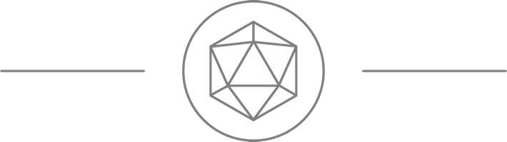

# MC02-I-4

|  |
|:---:|
| **Item** |
| **[Spiked Rosemelon](../items/spiked-rosemelon.md)** |
| *They say this weird plant is a delicacy, but personally I don’t get the appeal. I can however see why parched desert travellers would tolerate it.*
| A type of cacti, 1ft tall and pointed oval in shape. It is topped with a pink rose-like flower that only opens during the full moon. |
| Beyond its barbed and leathery exterior lies a core of melon-like flesh. |
