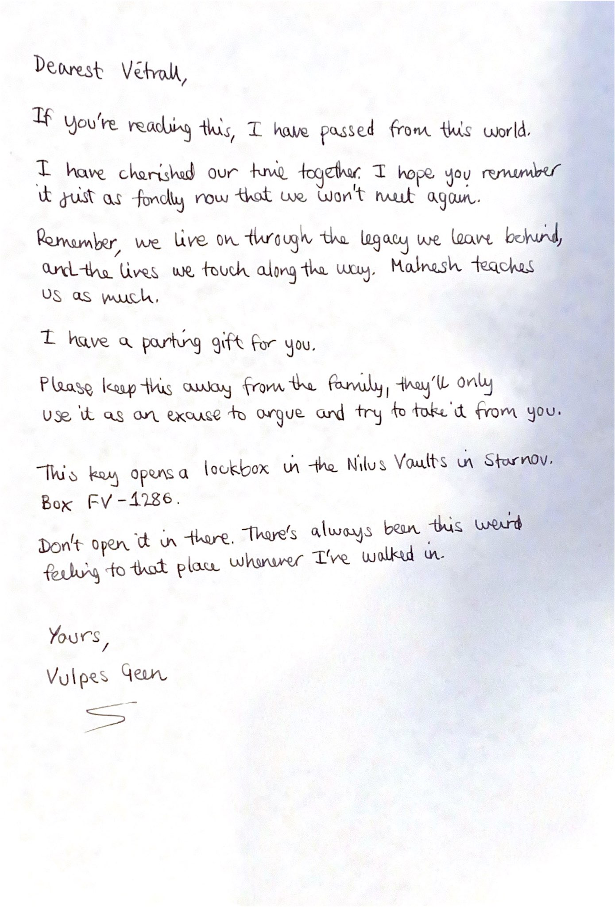

# MC01F-L-3

> Dearest Vētrall,
>
> If you're reading this, I have passed from this world.
>
> I have cherished our time together. I hope you remember it just as fondly now that we won't meet again.
>
> Remember, we live on through the legacy we leave behind, and the lives we touch along the way. [Malnesh](../../gods/deities/malnesh.md) teaches us as much.
>
> I have a parting gift for you.
>
> Please keep this away from the family, they'll only use it as an excuse to argue and try to take it from you.
>
> This key opens a lockbox in the Nilus Vaults in [Starnov](../../places/cities/starnov.md). Box FV-1286.
>
> Don't open it in there. There's always been this weird feeling to that place whenever I've walked in.
>
> Yours,  
> [Vulpes Geen](../../characters/vulpes-geen.md)
