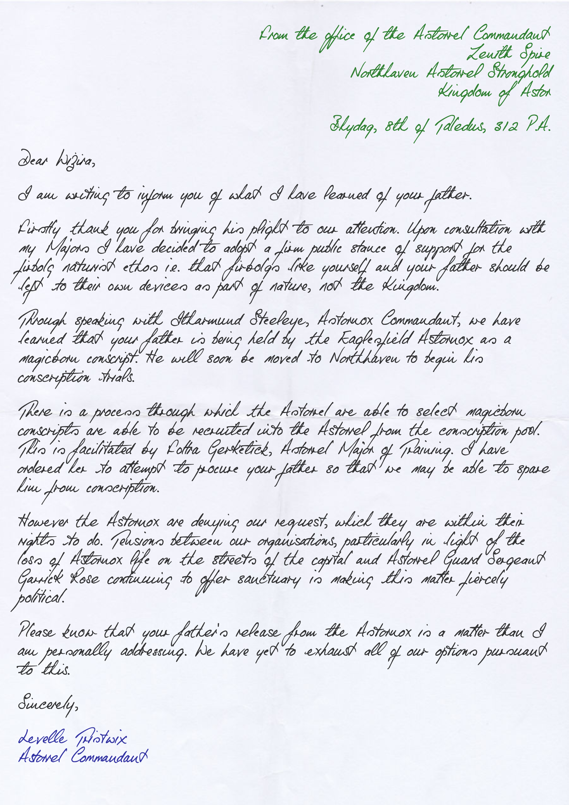

# PR19-L-2

> From the office of the [Astorrel Commandant](../../organisations/astorrel/ranks/astorrel-commandant.md)  
> [Zenith Spire](../../places/buildings/zenith-spire.md)  
> [Northhaven Astorrel Stronghold](../../places/strongholds/northhaven-astorrel-stronghold.md)  
> [Kingdom of Astor](../../civilisations/kingdom-of-astor/kingdom-of-astor.md)
>
> Bhydag, 8th of Taledus, 312 PA
>
> Dear [Wizira](../../characters/wizira.md),
>
> I am writing to inform you of what I have learned of your father.
>
> Firstly thank you for bringing his plight to our attention. Upon consultation with my Majors I have decided to adopt a firm public stance of support for the firbolg naturist ethos i.e. that firbolgs like yourself and your father should be left to their own devices as part of nature, not the Kingdom.
>
> Through speaking with [Itharmund Steeleye](../../characters/itharmund-steeleye.md), [Astornox Commandant](../../organisations/astornox/ranks/astornox-commandant.md), we have learned that your father is being held by the Eaglesfield [Astornox](../../organisations/astornox/astornox.md) as a [magicborn](../../civilisations/kingdom-of-astor/magicborn.md) conscript. He will soon be moved to [Northhaven](../../places/cities/northhaven.md) to begin his conscription trials.
>
> There is a process through which the [Astorrel](../../organisations/astorrel/astorrel.md) are able to select [magicborn](../../civilisations/kingdom-of-astor/magicborn.md) conscripts are able to be recruited into the [Astorrel](../../organisations/astorrel/astorrel.md) from the conscription pool. This is facilitated by [Foltra Gerketick](../../characters/foltra-gerketick.md), [Astorrel Major](../../organisations/astorrel/ranks/astorrel-major.md) of Training. I have ordered her to attempt to procure your father so that we may be able to spare him from conscription.
>
> However the [Astornox](../../organisations/astornox/astornox.md) are denying our request, which they are within their rights to do. Tensions between our organisations, particularly in light of the loss of [Astornox](../../organisations/astornox/astornox.md) life on the streets of the capital and [Astorrel Guard Sergeant](../../organisations/astorrel/ranks/astorrel-guard-sergeant.md) [Garrick Rose](../../characters/garrick-rose.md) continuing to offer [sanctuary](../../organisations/astorrel/sanctuary.md) is making this matter fiercely political.
>
> Please know that your father's release from the [Astornox](../../organisations/astornox/astornox.md) is a matter than I am personally addressing. We have yet to exhaust all of our options pursuant to this.
>
> Sincerely,
>
> [Levelle Tristwix](../../characters/levelle-tristwix.md)  
> [Astorrel Commandant](../../organisations/astorrel/ranks/astorrel-commandant.md)
