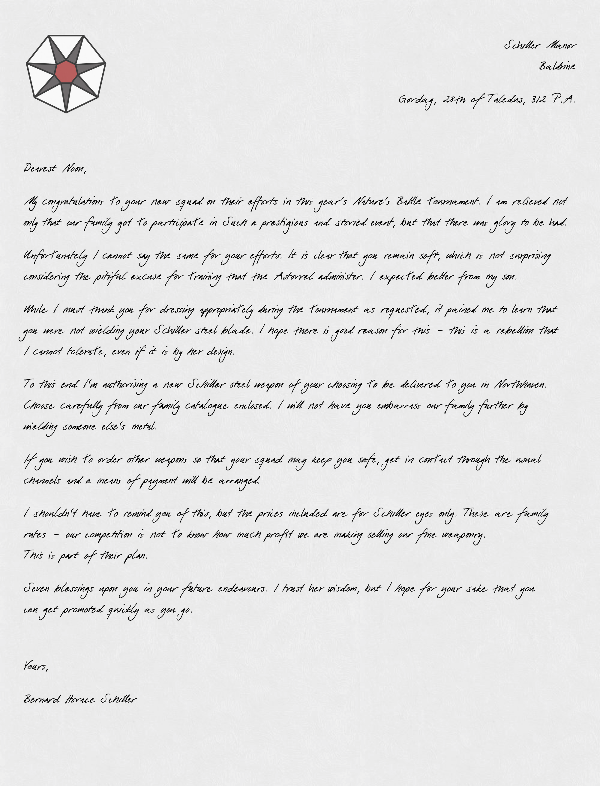
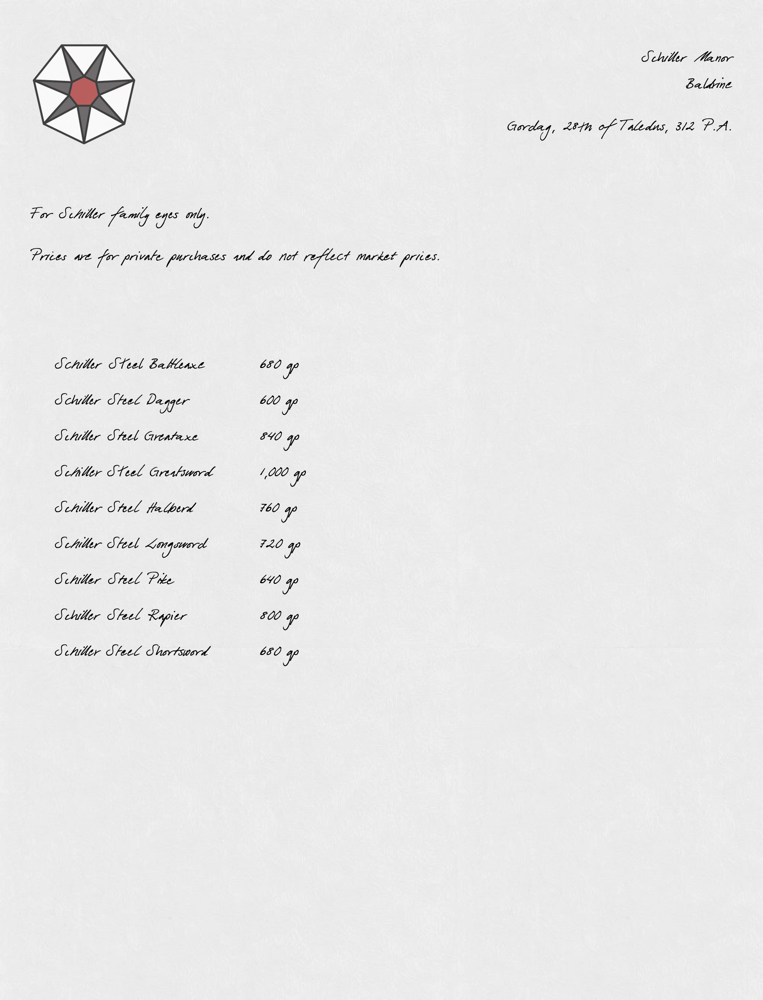

# Schiller Weapon Offer

| | |
|:---:|:---:|
|  |  |

## Page 1

> Schiller Manor  
> Baldrine
>
> Gordag, 28th of Taledus, 312 P.A.
>
> Dearest Noon,
>
> My congratulations to your new squad on their efforts in this year's [Nature's Battle](../../mechanics/roleplay/natures-battle.md) tournament. I am relieved not only that our family got to participate in such a prestigious and storied event, but that there was glory to be had.
>
> Unfortunately I cannot say the same for your efforts. It is clear that you remain soft, which is not surprising considering the pitiful excuse for training that the [Astorrel](../../organisations/astorrel/astorrel.md) administer. I expected better from my son.
>
> While I must thank you for dressing appropriately during the tournament as requested, it pained me to learn that you were not wielding your [Schiller steel](../../items/weapons/schiller-steel.md) blade. I hope there is good reason for this - this is a rebellion that I cannot tolerate, even if it is by her design.
>
> To this end I'm authorising a new [Schiller steel](../../items/weapons/schiller-steel.md) weapon of your choosing to be delivered to you in [Northhaven](../../places/cities/northhaven.md). Choose carefully from our family catalogue enclosed. I will not have you embarrass our family further by wielding someone else's metal.
>
> If you wish to order other weapons so that your squad may keep you safe, get in contact through the usual channels and a means of payment will be arranged.
>
> I shouldn't have to remind you of this, but the prices included are for Schiller eyes only. These are family rates - our competition is not to know how much profit we are making selling our fine weaponry. This is part of their plan.
>
> Seven blessings upon you in your future endeavours. I trust her wisdom, but I hope for your sake that you can get promoted quickly as you go.
>
> Yours,
>
> [Bernard Horace Schiller](../../characters/bernard-horace-schiller.md)

## Page 2

> Schiller Manor  
> Baldrine
>
> Gordag, 28th of Taledus, 312 P.A.
>
> For [Schiller family](../../organisations/schiller-family.md) eyes only.
>
> Prices are for private purchases and do not reflect market prices.
>
> [Schiller Steel](../../items/weapons/schiller-steel.md) Battleaxe - 680 gp  
> [Schiller Steel](../../items/weapons/schiller-steel.md) Dagger - 600 gp  
> [Schiller Steel](../../items/weapons/schiller-steel.md) Greataxe - 840 gp  
> [Schiller Steel](../../items/weapons/schiller-steel.md) Greatsword - 1,000 gp  
> [Schiller Steel](../../items/weapons/schiller-steel.md) Halberd - 760 gp  
> [Schiller Steel](../../items/weapons/schiller-steel.md) Longsword - 720 gp  
> [Schiller Steel](../../items/weapons/schiller-steel.md) Pike - 640 gp  
> [Schiller Steel](../../items/weapons/schiller-steel.md) Rapier - 800 gp  
> [Schiller Steel](../../items/weapons/schiller-steel.md) Shortsword - 680 gp
