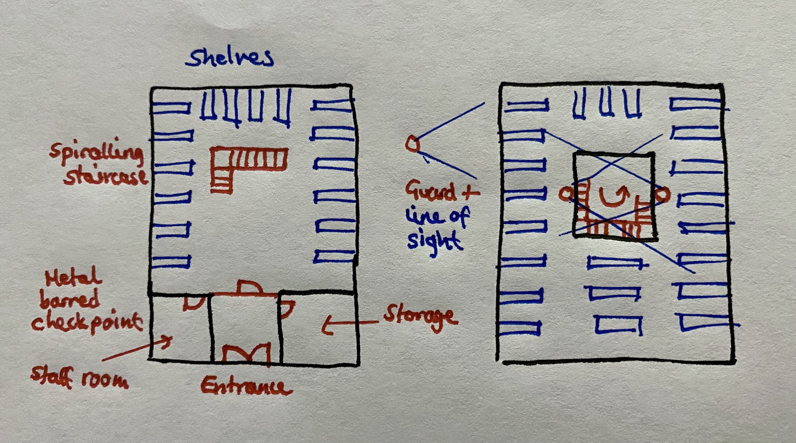

# Nilus Vaults

|||
| --- | --- |
| **Name** | Nilus Vaults | place.4
| **Type** | Building |
| **Location** | [Starnov](../../cities/starnov.md) [Nilus Coast](../../../civilisations/nilsavnic-alliance/states/nilus-coast.md) [Nil'Savnic Alliance](../../../civilisations/nilsavnic-alliance/nilsavnic-alliance.md) |
| **Nearby Places** | [The Round Goose](../inns-taverns/the-round-goose.md) |
| **People** | |

## Summary

The Nilus Vaults is a bank full of secure lock boxes, giving its patrons somewhere to store their valuables. It is operated by the [Nilus Coast](../../../civilisations/nilsavnic-alliance/states/nilus-coast.md) government and secured by the [Coastguard](../../../organisations/guards/coastguard.md).

### Exterior

From the outside the Nilus Vaults are only somewhat noteworthy.

A large four storey building of tall floors, the building is a presence that looms over the surrounding buildings, all except the nearby indoor marketplace which is a comparable height.

The structure is rectangular, constructed of grey stone in large blocks. Tall and narrow paned glass windows can be seen above the ground floor, framed with delicately arranged marble, using the marble's grain to create a pattern around the windows.

The roof is sloped toward the edges and made of darkened tiles. The main part of the roof is large panes of glass that let the sunlight through.

Outside it is common to see a group of [Coastguard](../../../organisations/guards/coastguard.md) hanging around, though not actively assigned to the building itself. Patrons coming and going is rare, and typically they are aristocratic commoners wearing fineries.

### Entrance

Two large double doors open up into a 15ft wide by 20ft long hall. At its end is a screen of metal bars, with a gate cut out of it, also made of the same metal bars. It is locked by a key held by the two [Coastguards](../../../organisations/guards/coastguard.md) who are on opposite sides of the screen.

In order to enter, a key to a lock box must be produced ([MC01F-I-3](../../../cards/MC01F-I-3.md) / [MC01M-I-1](../../../cards/MC01M-I-1.md)). The gems set into the key's head denote which floor the lockbox is located, giving the guards an idea of where the patron will be heading. Each key only opens one lock box. A code system is used to identify the lock box, e.g. `AB-123`.

Trays are brought in from the adjoining store room so that patrons can store any items they wish to leave before entering. The trays are made by removing hinges from typical wooden chests. Weapons and bags not needed for storage must be stowed away.

### Interior

Beyond the gate is a large open plan space that occupies all four floors. A central square shaped column cuts through each floor, creating a 360 degree mezzanine level on the upper floors. A spiralling staircase ascends from the middle of the room counter-clockwise, following the square shape of the skylight.

On each floor are lock boxes. Each floor contains different sizes, many of which are arranged on metal racks that resemble bookshelves. Each lock box is bolted down. Each rack has two letters stamped onto its side to denote where different ranges of lock box identifiers can be found.

| Floor | Lock Box Type | Description |
| --- | --- | --- |
| 0F | Small | A5 filing box sized. |
| 1F | Medium | A4 filing box sized. |
| 2F | Locker | American school locker sized. No shelves. |
| 3F | Chest | 1.5x size chest capable of fitting a longsword in diagonally. Bolted to the floor. |

On the upper floors railings surround the skylight. Guards are positioned behind these railings, with 2 or 3 guards per floor. Looking across the gap at each other, each guard can see roughly half of their floor, and can look down at the floor(s) below.

