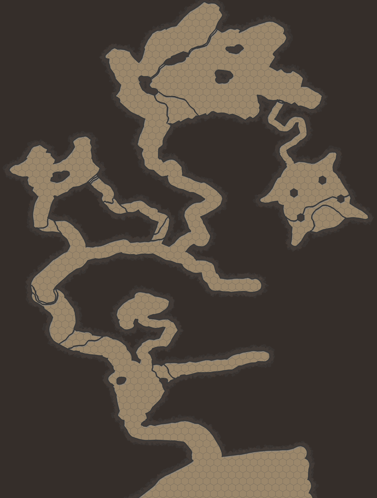

# Blue Kobold Cave

|  | |
| --- | --- |
| **Name** | Blue Kobold Cave |
| **Type** | Cave |
| **Location** | [Walna Forest](../forests/walna-forest.md) [Central Astor](../regions/central-astor.md) |
| **Nearby Places** | [Arnaside](../villages/arnaside.md) |
| **People** | [Ikra](../../characters/ikra.md) |

## Summary

The Blue Kobold Cave system is set within a hill deep in the [Walna Forest](../forests/walna-forest.md), north of the [Arnaside Logging Camp](../structures/arnaside-logging-camp.md). It is home to a tribe of [blue kobolds](../../lineages/blue-kobold.md).

The cave itself has been carved into the stone hillside, with maze-like twisting passageways, elevation changes, large open rooms, and an inner sanctum hidden behind a wooden door and narrow snaking passageway.

The inner sanctum features 4 angled hexagonal pillars made of the same surrounding stone, but perfectly smooth and unnaturally proportional, created by [Cheorrosdyr](../../characters/cheorrosdyr.md) when the tribe was left here. Beyond them a raised area contains a small pedestal containing the tribes most coveted possessions:

| Item | Value |
| --- |:---:|
| [Blue Dragon Scale Necklace](../../items/blue-dragon-scale-necklace.md) | |
| Large polished turquoise gemstone | 15 gp |

## Map

